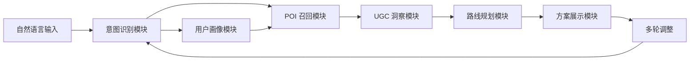

# SmartRoute Agent — 产品需求文档（PRD）

> **文档版本**：v1.0  
> **撰写日期**：2026-05-10  
> **文档状态**：正式稿  
> **适用范围**：产品、研发、算法、测试、运营团队

---

## 目录

1. [文档说明](#一文档说明)
2. [产品背景与战略定位](#二产品背景与战略定位)
3. [用户研究与需求分析](#三用户研究与需求分析)
4. [产品目标与成功指标](#四产品目标与成功指标)
5. [功能需求详述](#五功能需求详述)
6. [非功能需求](#六非功能需求)
7. [用户交互流程设计](#七用户交互流程设计)
8. [数据需求](#八数据需求)
9. [系统边界与外部依赖](#九系统边界与外部依赖)
10. [约束与限制](#十约束与限制)
11. [验收标准](#十一验收标准)
12. [里程碑与排期](#十二里程碑与排期)
13. [风险与应对](#十三风险与应对)
14. [附录：术语表](#十四附录术语表)

---

## 一、文档说明

### 1.1 编写目的

本文档是 SmartRoute Agent 系统的产品需求文档，旨在明确系统的业务目标、用户需求、功能边界与验收标准，作为研发团队设计、开发和测试的核心依据。文档面向产品经理、后端工程师、算法工程师、前端工程师及测试工程师。

### 1.2 文档范围

本文档覆盖 SmartRoute Agent 系统 MVP 版本（v1.0）及增强版本（v1.1）的完整需求，包括用户侧功能需求、系统侧非功能需求、数据需求及验收标准。不包含商业化运营策略、广告系统及第三方平台接入协议细节。

### 1.3 参考文档

| 文档名称 | 版本 | 说明 |
|---------|------|------|
| SmartRoute Agent 技术方案文档 | v2.0 | 系统技术架构参考 |
| 项目任务背景说明 | v1.0 | 业务背景与交付目标 |

---

## 二、产品背景与战略定位

### 2.1 问题陈述

当用户计划出行或游玩时，面临的核心痛点可归纳为三类：**信息过载**、**决策成本高**和**方案执行难**。

在信息获取层面，用户需要在大众点评、小红书、高德地图等多个平台间反复切换，手动筛选 POI（兴趣点），自行判断评价真实性，整个过程耗时且低效。在决策层面，用户面临"想吃好又不想排队""时间有限但景点众多""带老人/孩子有特殊需求"等多重约束的同时权衡，传统搜索工具无法提供综合决策支持。在执行层面，即便用户完成了路线规划，也难以保证路线在时间窗口、交通方式、营业时间等维度的可行性。

### 2.2 市场机会

国内旅游出行市场规模持续扩大，用户对"即时可用、高度个性化"的出行规划需求日益强烈。现有解决方案（如携程行程规划、高德导航、大众点评推荐）均聚焦于单一维度，缺乏将 POI 推荐、路线优化、个性化偏好与 UGC 智慧融合的端到端解决方案。大语言模型的成熟为构建自然语言驱动的智能规划系统提供了技术基础。

### 2.3 产品定位

SmartRoute Agent 是一款**基于大语言模型的本地智能路线规划系统**，通过多 Agent 协同架构，将用户的自然语言意图转化为可直接执行的个性化路线方案。系统核心价值在于：

- **零门槛输入**：用户以自然语言描述需求，无需填写结构化表单
- **多维度最优**：综合时间、距离、口碑、偏好、预算等多重约束生成最优方案
- **可执行输出**：生成的方案包含具体时间安排、交通方式、注意事项，可直接执行
- **动态调整**：支持多轮对话式调整，局部修改无需重新规划全程

### 2.4 竞品对比

| 维度 | 携程 AI 行程 | 高德路线规划 | 小红书推荐 | **SmartRoute Agent** |
|-----|------------|------------|----------|---------------------|
| 输入方式 | 结构化表单 | 起终点输入 | 关键词搜索 | **自然语言** |
| 个性化程度 | 低（通用模板）| 无 | 中（标签推荐）| **高（历史画像）** |
| UGC 融合 | 无 | 无 | 有（非结构化）| **深度结构化分析** |
| 多约束优化 | 部分 | 单一（距离）| 无 | **全维度约束求解** |
| 多轮调整 | 有限 | 无 | 无 | **完整多轮对话** |
| 方案可执行性 | 中 | 高（导航）| 低 | **高（含时间安排）** |

---

## 三、用户研究与需求分析

### 3.1 目标用户群体

SmartRoute Agent 的核心目标用户为**有主动规划意愿的出行者**，细分为以下四类人群：

**休闲游玩用户**是最主要的目标群体，包括周末短途游、城市 City Walk、节假日景区游览等场景。这类用户对个性化体验要求较高，愿意为高质量推荐付出时间成本，但不具备专业的路线规划能力。

**家庭出行用户**面临成员构成复杂（老人、儿童）带来的特殊需求，对无障碍设施、亲子友好场所、步行距离等有明确约束，现有工具难以满足其差异化需求。

**商务出行用户**时间紧张、行程固定，需要在有限时间窗口内高效安排餐饮与休闲，对时间精确性要求极高。

**本地探索用户**熟悉城市基本情况，希望发现小众、高质量的新地点，对口碑分析和个性化推荐的依赖度更高。

### 3.2 用户痛点深度分析

| 痛点类别 | 具体表现 | 影响程度 |
|---------|---------|---------|
| 信息分散 | 需在 3-5 个 App 间切换收集信息 | 高 |
| 决策疲劳 | 面对大量选项无法高效决策 | 高 |
| 时间规划失误 | 低估交通/排队时间导致行程混乱 | 高 |
| 个性化缺失 | 推荐结果与个人偏好不符 | 中 |
| 方案不可执行 | 规划方案与实际情况（营业时间等）不符 | 高 |
| 调整成本高 | 临时改变计划需重新规划全程 | 中 |

### 3.3 核心用户故事

**Story 1（首次规划）**：作为一名计划周末带父母游西湖的用户，我希望输入"明天带父母去西湖玩一天，妈妈腿脚不好，预算 500 元"，系统能自动生成一套考虑到老人行动不便、控制步行距离、包含午餐安排的完整路线，这样我就不需要花几个小时在各平台查资料。

**Story 2（偏好调整）**：作为一名已获得路线方案的用户，我希望说"楼外楼太贵了，换一家便宜点的杭帮菜"，系统能在保持其他安排不变的情况下，仅替换餐厅并重新计算时间，而不是重新规划整个行程。

**Story 3（时间约束）**：作为一名下午 5 点有会议的商务用户，我希望说"我 5 点要回去，帮我调整一下"，系统能自动裁剪行程并给出合理的时间安排建议。

**Story 4（个性化推荐）**：作为一名偏爱小众、非网红场所的用户，我希望系统能基于我的历史偏好，主动推荐评分高但知名度相对较低的 POI，而非总是推荐热门景点。

---

## 四、产品目标与成功指标

### 4.1 产品目标

SmartRoute Agent 的产品目标分为三个层次：

**核心目标（MVP）**：实现从自然语言输入到可执行路线方案的完整闭环，支持基础的多约束路线生成和多轮调整。

**体验目标（v1.1）**：通过用户画像和 UGC 洞察提升方案个性化程度，使推荐结果与用户实际偏好高度匹配。

**长期目标（v2.0+）**：构建持续学习的个性化引擎，基于用户反馈不断优化推荐质量，形成数据飞轮效应。

### 4.2 关键成功指标（KPI）

#### 系统性能指标

| 指标 | MVP 目标 | v1.1 目标 | 说明 |
|-----|---------|---------|------|
| 首次规划响应时间 P95 | ≤ 10s | ≤ 8s | 端到端完整流程 |
| 局部调整响应时间 P95 | ≤ 5s | ≤ 3s | MODIFY 类请求 |
| 流式首字延迟 | ≤ 3s | ≤ 2s | 用户感知响应速度 |
| 系统可用性 | ≥ 99% | ≥ 99.5% | 月度统计 |
| 营业时间满足率 | 100% | 100% | 硬约束，不可妥协 |

#### 质量指标

| 指标 | 目标值 | 评估方式 |
|-----|-------|---------|
| 意图识别准确率 | ≥ 92% | 标注集测试 |
| 方案用户采纳率 | ≥ 60% | 用户行为埋点 |
| 方案可执行率 | ≥ 95% | 人工抽样验证 |
| 个性化满意度 | ≥ 4.0/5.0 | 用户评分 |
| 多轮调整成功率 | ≥ 90% | 对话日志分析 |

#### 业务指标

| 指标 | 目标值 | 统计周期 |
|-----|-------|---------|
| 用户次日留存率 | ≥ 40% | 月度统计 |
| 平均对话轮次 | ≥ 2.5 轮 | 会话统计 |
| 方案完整阅读率 | ≥ 70% | 前端埋点 |

---

## 五、功能需求详述

### 5.1 功能模块总览

SmartRoute Agent 系统由七个核心功能模块组成，各模块既相互独立又协同工作，共同支撑完整的路线规划体验。



### 5.2 F01 — 自然语言意图识别

#### 5.2.1 功能描述

系统接收用户的自由文本输入，将其解析为结构化的意图信息，包括出行目的、时空约束、人员构成、偏好要求和预算范围等维度。意图识别是整个系统的入口，其准确性直接决定后续所有模块的输出质量。

#### 5.2.2 输入规格

| 输入类型 | 示例 | 处理要求 |
|---------|------|---------|
| 简单意图 | "明天去西湖玩" | 基础槽位抽取 |
| 复杂意图 | "周六带两个老人和一个 5 岁小孩，预算 800 元，想吃杭帮菜" | 多槽位联合抽取 |
| 含隐式约束 | "带老人去" | 自动推断：避免长距离步行、爬山 |
| 多轮追加 | "再加一个下午茶" | 增量意图融合 |
| 歧义输入 | "去附近玩" | 触发反问：请问您在哪个城市/区域？ |

#### 5.2.3 输出规格

系统需从用户输入中抽取并结构化以下信息字段：

| 字段类别 | 字段名 | 类型 | 必填 | 说明 |
|---------|-------|------|------|------|
| 意图类型 | intent_type | Enum | 是 | 游览/美食/City Walk/商务/约会/家庭 |
| 空间约束 | city, region, anchor_poi, radius_km | String/Float | 是 | 城市、区域、锚点、半径 |
| 时间约束 | date, time_window, duration_hours | Date/String/Float | 是 | 日期、时段、时长 |
| 人员构成 | size, composition, special_needs | Int/Array | 是 | 人数、构成（老人/儿童等）|
| 偏好 | must_have, nice_to_have, avoid, themes | Array | 否 | 必须/希望/避免/主题 |
| 预算 | per_person, level | Float/Enum | 否 | 人均金额或档位 |
| 歧义标记 | ambiguity_flags | Array | 自动 | 需要反问的字段 |
| 推断字段 | inferred_fields | Array | 自动 | 系统自动推断的字段 |

#### 5.2.4 隐式推理规则（部分）

系统需内置以下隐式推理规则，在用户未明确表达时自动补全约束：

- 人员构成包含老人 → 自动添加"避免长距离步行（>3km）"和"避免爬山"约束
- 人员构成包含 6 岁以下儿童 → 自动添加"优先室内/有遮蔽场所"和"优先有母婴室"偏好
- 输入包含"出差/商务" → 意图类型设为 business，时间灵活性设为 strict
- 时长未指定但提到"一日游" → 时长默认设为 8 小时（09:00-17:00）
- 未指定预算且意图类型为 date（约会）→ 预算档位默认设为中高档

#### 5.2.5 歧义处理规则

当以下情况发生时，系统应主动反问用户：

- 城市/区域信息完全缺失
- 日期信息缺失（无法从上下文推断）
- 意图类型置信度低于 0.7
- 关键约束存在明显矛盾（如时长 2 小时但 must_have 包含 5 个景点）

反问应简洁、友好，每次最多提出 2 个问题，避免让用户感到填表负担。

#### 5.2.6 验收标准

- 字段抽取 F1 Score ≥ 0.90（基于 500 条标注测试集）
- 意图分类准确率 ≥ 0.92
- 隐式推理规则触发精确率 ≥ 0.85
- 歧义检测误报率 ≤ 10%（不应对清晰输入触发反问）

---

### 5.3 F02 — 用户画像与个性化偏好

#### 5.3.1 功能描述

系统基于用户历史行为数据构建动态个性化画像，在路线规划全流程中注入个性化信号，使推荐结果与用户真实偏好高度匹配。画像分为长期偏好（基于历史数据）和短期偏好（基于当前 Session 行为）两个维度。

#### 5.3.2 画像维度需求

| 维度 | 数据来源 | 更新频率 | 用途 |
|-----|---------|---------|------|
| 菜系偏好 | 历史下单、浏览记录 | T+1 离线 + 实时 | 餐厅召回排序 |
| 消费档位 | 历史消费客单价 | T+1 离线 | 预算约束校准 |
| 场景偏好 | 历史路线类型 | T+1 离线 | 路线风格匹配 |
| 步行耐受度 | 历史路线步行距离 | T+1 离线 | 步行约束设置 |
| 饮食禁忌 | 用户主动设置 | 实时 | 硬过滤 |
| 时段偏好 | 历史出行时段分布 | T+1 离线 | 时间安排优化 |
| 已去过的 POI | 历史足迹 | 实时 | 去重过滤 |
| 偏好标签 | 用户主动选择 | 实时 | 冷启动补充 |

#### 5.3.3 冷启动处理

对于新用户（历史数据不足），系统需提供以下冷启动方案：

**引导式偏好收集**：首次使用时，通过简洁的卡片式交互引导用户选择 3-5 个偏好标签（如"喜欢小众/网红/自然风光/美食探索"等），收集结果立即生效。

**人群标签兜底**：基于用户基本属性（城市、年龄段等）匹配相似人群的偏好分布，作为个性化信号的初始值。

**Session 内学习**：在当前对话中，用户的选择行为（如拒绝某类 POI、接受某种风格）应实时更新短期偏好，影响后续推荐。

#### 5.3.4 隐私与合规需求

- 用户可在设置中关闭个性化功能，关闭后系统仅使用通用推荐策略
- 个人偏好数据不得用于广告定向或第三方共享
- 用户可申请删除其全部历史画像数据
- 数据存储和处理需符合《个人信息保护法》相关要求

---

### 5.4 F03 — POI 召回与筛选

#### 5.4.1 功能描述

系统从 POI 数据库中召回满足用户意图和约束的候选地点集合，综合运用语义检索、地理围栏、协同过滤等多路召回策略，确保候选集的相关性、多样性和覆盖度。

#### 5.4.2 召回策略需求

系统需支持以下五种召回路径并行执行：

**语义召回**：将用户意图转化为向量表示，在 POI 向量库中检索语义相关的地点，重点捕获用户意图中的主题性需求（如"文艺气息""亲子友好"等）。

**地理召回**：基于用户指定的地理范围（城市/区域/锚点+半径）进行空间过滤，确保所有候选 POI 在合理的地理范围内。

**协同过滤召回**：基于相似用户的历史行为，推荐"与你相似的人也喜欢"的 POI，增强个性化深度。

**类目硬约束召回**：对用户明确指定的 POI 类型（如"必须有杭帮菜餐厅"）执行精确类目匹配，确保硬约束被满足。

**热门兜底召回**：对于冷启动或召回量不足的情况，补充城市/品类热门 POI 列表，保证候选集数量。

#### 5.4.3 过滤与排序需求

召回后需执行以下过滤和排序操作：

| 操作 | 规则 | 优先级 |
|-----|------|-------|
| 硬过滤 | 营业时间不覆盖用户出行时段的 POI 直接排除 | 最高 |
| 硬过滤 | 用户饮食禁忌相关 POI 直接排除 | 最高 |
| 硬过滤 | 用户已去过的 POI（用户可选择是否过滤）| 高 |
| 软排序 | 综合语义相关度、个性化匹配度、热度、距离打分 | 中 |
| 多样性重排 | 确保候选集类目多样性，避免同类 POI 过多 | 中 |
| 负反馈过滤 | 用户在当前 Session 中明确拒绝的 POI 排除 | 高 |

#### 5.4.4 输出规格

召回模块输出候选 POI 列表，每个 POI 包含以下基础信息：

| 字段 | 类型 | 说明 |
|-----|------|------|
| poi_id | String | 唯一标识 |
| name | String | POI 名称 |
| category | String | 类目（餐厅/景点/购物等）|
| location | GeoPoint | 经纬度坐标 |
| address | String | 详细地址 |
| business_hours | Array | 营业时间（含节假日）|
| avg_cost | Float | 人均消费 |
| rating | Float | 综合评分 |
| review_count | Int | 评论数量 |
| tags | Array | 场景标签 |
| retrieval_score | Float | 召回综合得分 |

---

### 5.5 F04 — UGC 评论洞察

#### 5.5.1 功能描述

系统对候选 POI 的用户评论进行深度分析，提取超越星级评分的细粒度信息，包括各维度口碑评分、排队情况、适合场景、避雷提示等，为路线规划提供更丰富的决策依据。

#### 5.5.2 分析维度需求

系统需对每个 POI 的评论分析以下维度：

| 分析维度 | 输出形式 | 说明 |
|---------|---------|------|
| 多维度评分 | Float(0-5) | 食物/服务/环境/等待时间分维度评分 |
| 亮点提取 | String Array | 高频正面评价摘要（≤3条）|
| 避雷提示 | String Array | 高频负面评价摘要（≤3条）|
| 最佳游览时间 | String | 基于评论推断的最佳时段 |
| 场景标签 | String Array | 亲子/约会/商务/独酌等场景适配度 |
| 人群匹配度 | Float(0-1) | 与当前用户画像的场景匹配分 |
| 排队预警 | String | 排队情况描述（如"周末排队 1h+"）|

#### 5.5.3 数据时效性需求

- 评论分析结果需基于近 3 个月的评论数据，确保时效性
- 分析结果缓存有效期为 7 天，过期后触发增量更新
- 节假日前后（如春节、五一）需主动刷新热门 POI 的分析结果
- 对于新开业 POI（评论数 < 20），需标注"数据不足，仅供参考"

#### 5.5.4 质量保障需求

- 系统需具备水军/广告评论识别能力，过滤异常评论后再进行分析
- 对于差评（≤3星）需单独聚类分析，提取共性问题作为避雷提示
- 分析结果需标注置信度，低置信度结果不展示给用户

---

### 5.6 F05 — 智能路线规划

#### 5.6.1 功能描述

路线规划模块是系统的决策核心，在满足用户所有硬约束的前提下，通过数学优化求解出时间安排合理、体验质量高的 POI 访问序列，并生成多个差异化方案供用户选择。

#### 5.6.2 约束建模需求

系统需支持以下两类约束：

**硬约束（必须满足，违反则方案无效）**：

| 约束类型 | 具体规则 |
|---------|---------|
| 营业时间 | 每个 POI 的访问时间必须在其营业时间范围内 |
| 用餐时段 | 路线中必须包含至少一个餐厅，且安排在 11:30-13:30（午餐）或 17:30-19:30（晚餐）|
| 地理范围 | 所有 POI 必须在用户指定的地理范围内 |
| 末班交通 | 路线结束时间必须早于末班公共交通时间（如有需要）|
| 饮食禁忌 | 餐厅不得包含用户禁忌食材 |

**软约束（尽量满足，可在无解时放松）**：

| 约束类型 | 默认权重 | 说明 |
|---------|---------|------|
| 总步行距离 | 0.3 | 控制体力消耗 |
| 总等待时间 | 0.2 | 减少排队 |
| 体验质量得分 | 0.4 | 最大化综合体验 |
| 总费用 | 0.1 | 控制预算 |

#### 5.6.3 多方案生成需求

系统需生成 **3 个差异化路线方案**，每个方案代表不同的权重偏好组合：

| 方案 | 风格定位 | 核心权重倾向 |
|-----|---------|------------|
| 方案 A（经典稳妥）| 适合首次到访，兼顾体验与效率 | 体验 40%，时间 30%，等待 20%，费用 10% |
| 方案 B（避峰省时）| 适合不喜排队、时间敏感用户 | 等待 50%，时间 20%，体验 20%，费用 10% |
| 方案 C（极致体验）| 适合追求最佳体验、不在意排队 | 体验 70%，时间 10%，等待 10%，费用 10% |

**差异度保证**：三个方案之间的 POI 重叠率不得超过 50%，确保用户有真实的选择空间。

#### 5.6.4 时间安排规格

每个路线方案需包含以下时间信息：

- 每个 POI 的建议到达时间和离开时间
- POI 之间的交通方式和预计耗时
- 每个 POI 的建议游览/用餐时长
- 排队等待时间预估（基于历史数据和时段）
- 全程总时长、总步行距离、总费用估算

#### 5.6.5 降级策略需求

当优化求解器无法找到满足所有约束的方案时，系统需按以下顺序执行降级：

1. **放松软约束**：逐步放宽步行距离、等待时间等软约束，重新求解
2. **LLM 兜底**：调用大语言模型进行启发式排序，生成近似最优方案
3. **简化输出**：返回 Top-K POI 列表（不含精确时间安排），并向用户说明原因

---

### 5.7 F06 — 方案展示与多轮调整

#### 5.7.1 方案展示需求

系统生成的路线方案需以用户友好的方式呈现，包含以下内容：

**方案概览**：每个方案的名称、标语、核心亮点（3 条）、总时长、总费用、适合人群说明。

**时间轴详情**：按时间顺序列出每个 POI 的访问安排，包含到达时间、游览时长、交通方式、费用估算、个性化推荐理由。

**个性化解释**：对每个 POI 的推荐理由需结合用户画像生成个性化说明（如"考虑到您带老人出行，优先选择步行少的路线"），而非通用描述。

**方案对比**：以简洁的对比说明突出三个方案的核心差异点，帮助用户快速做出选择。

**可调整提示**：主动提示用户哪些 POI 可以替换、哪些时间安排可以调整，降低用户的调整门槛。

#### 5.7.2 多轮调整需求

系统需支持以下类型的多轮调整，且每次调整应在 3 秒内返回更新结果：

| 调整类型 | 示例输入 | 系统行为 |
|---------|---------|---------|
| 替换单个 POI | "把楼外楼换成便宜点的" | 仅重新召回同类 POI，其余不变 |
| 添加 POI | "再加一个下午茶" | 在现有路线中插入新 POI |
| 删除 POI | "去掉断桥残雪" | 从路线中移除并重新计算时间 |
| 修改时间约束 | "我 5 点要走" | 仅重新规划时间安排，POI 池复用 |
| 修改偏好 | "想吃辣的" | 更新偏好后重新召回餐厅类 POI |
| 完全重做 | "不去西湖了，改去灵隐寺" | 保留用户画像，全链路重新规划 |

#### 5.7.3 上下文保持需求

- 系统需在整个对话 Session 内保持上下文，用户无需重复说明已提过的约束
- Session 有效期为 24 小时，超时后自动清除
- 用户可通过"重新开始"指令清除当前 Session，开始全新规划

---

## 六、非功能需求

### 6.1 性能需求

| 指标 | 要求 | 说明 |
|-----|------|------|
| 首次规划响应时间 P95 | ≤ 8s | 完整 6-Agent 流程 |
| 局部调整响应时间 P95 | ≤ 3s | MODIFY 类请求 |
| 流式首字延迟 | ≤ 2s | 用户感知响应速度 |
| 系统吞吐量 | ≥ 100 QPS | 峰值并发处理能力 |
| POI 召回延迟 P95 | ≤ 500ms | 多路召回并行执行 |
| 路线求解时间 P95 | ≤ 2s | OR-Tools 求解器 |

### 6.2 可用性与可靠性需求

- 系统月度可用性 ≥ 99.5%（允许月度停机时间 ≤ 3.6 小时）
- 单个 Agent 故障不应导致整体服务不可用，需有降级策略
- LLM API 调用失败时，系统需在 3 次重试后切换备用供应商
- 关键数据（用户画像、Session 状态）需持久化存储，防止丢失

### 6.3 安全性需求

- 用户输入需经过敏感词过滤，防止 Prompt Injection 攻击
- LLM 输出需经过内容安全过滤，确保不输出违规内容
- 用户个人数据需加密存储，传输过程使用 HTTPS/TLS
- API 接口需进行身份认证和请求频率限制

### 6.4 可扩展性需求

- 系统架构需支持水平扩展，可通过增加实例应对流量增长
- Agent 模块设计需支持独立部署和升级，不影响其他模块
- LLM 供应商需支持热切换，不需要停机即可更换模型
- POI 数据源需支持多源接入，可灵活增减数据供应商

### 6.5 可观测性需求

- 全链路请求追踪：每个请求需有唯一 trace_id，可追踪经过的所有 Agent
- 关键指标监控：LLM Token 消耗、Agent 延迟、错误率需实时监控
- 告警机制：关键指标超阈值时需在 5 分钟内触发告警
- 日志规范：所有 Agent 的输入输出需结构化记录，支持离线分析

---

## 七、用户交互流程设计

### 7.1 主流程：首次规划

```mermaid
flowchart TD
    A[用户输入自然语言需求] --> B{意图是否清晰?}
    B -- 否 --> C[系统反问补充信息]
    C --> A
    B -- 是 --> D[系统展示"规划中..."状态]
    D --> E[流式输出开始，首字 ≤ 2s]
    E --> F[展示 3 个差异化方案]
    F --> G{用户是否满意?}
    G -- 满意 --> H[用户收藏/导出方案]
    G -- 需要调整 --> I[用户提出调整需求]
    I --> J{调整类型?}
    J -- 局部调整 --> K[局部重规划 ≤ 3s]
    J -- 完全重做 --> L[全链路重规划 ≤ 8s]
    K --> F
    L --> F
```

### 7.2 异常处理流程

| 异常场景 | 用户感知 | 系统处理 |
|---------|---------|---------|
| 意图无法识别 | 友好提示 + 引导示例 | 返回示例输入格式 |
| 指定区域无合适 POI | 提示扩大范围或更换区域 | 自动扩大搜索半径 |
| 时间约束过于紧张 | 提示时间不足 + 建议精简 | 推荐精简版方案 |
| LLM 服务超时 | 显示"正在努力规划中..." | 切换备用模型重试 |
| 所有约束无法同时满足 | 说明冲突原因 + 建议放宽 | 降级返回 POI 列表 |

### 7.3 前端交互规范

- 输入框需支持多行文本，最大长度 500 字符
- 规划过程中需展示进度动画，避免用户误以为系统无响应
- 方案展示需支持卡片式布局，每个方案可展开查看详情
- 地图组件需在方案展示时同步标注路线和 POI 位置
- 支持方案导出为图片或文本格式，方便分享

---

## 八、数据需求

### 8.1 POI 基础数据

| 数据字段 | 来源 | 更新频率 | 质量要求 |
|---------|------|---------|---------|
| POI 基础信息（名称/地址/坐标）| 高德/大众点评 API | 每日增量 | 准确率 ≥ 99% |
| 营业时间 | 大众点评/美团 API | 每日增量 | 准确率 ≥ 95% |
| 人均消费 | 大众点评/美团 API | 每周 | 误差 ≤ 20% |
| 综合评分 | 大众点评 API | 每日 | 实时同步 |
| 场景标签 | 系统自动生成 + 人工审核 | 每月 | 覆盖率 ≥ 90% |
| POI 向量表示 | 系统离线计算 | 每周 | - |

### 8.2 UGC 评论数据

| 数据字段 | 来源 | 保留周期 | 质量要求 |
|---------|------|---------|---------|
| 评论原文 | 大众点评 API | 近 12 个月 | 水军过滤后保留 |
| 评论时间 | 大众点评 API | - | 精确到天 |
| 评论评分 | 大众点评 API | - | 1-5 分 |
| 分析结果缓存 | 系统生成 | 7 天 TTL | - |

### 8.3 用户行为数据

| 数据类型 | 收集方式 | 存储位置 | 保留周期 |
|---------|---------|---------|---------|
| 历史路线 | 系统记录 | 业务数据库 | 24 个月 |
| POI 浏览记录 | 前端埋点 | ClickHouse | 12 个月 |
| 方案采纳/拒绝 | 前端埋点 | ClickHouse | 12 个月 |
| 对话记录 | 系统记录 | 业务数据库 | 6 个月 |
| 用户偏好设置 | 用户主动设置 | 业务数据库 | 永久（用户删除前）|

### 8.4 地理与交通数据

| 数据类型 | 来源 | 用途 |
|---------|------|------|
| POI 间距离矩阵 | 高德/百度地图 API | 路线规划 |
| 实时路况 | 高德地图 API | 通勤时间预测 |
| 公共交通时刻表 | 高德 Transit API | 末班车判断 |
| 天气数据 | 和风天气 API | 排队时间修正 |

---

## 九、系统边界与外部依赖

### 9.1 系统边界

SmartRoute Agent 系统**包含**以下能力：

- 自然语言意图理解与结构化解析
- 基于多路召回的 POI 候选集生成
- UGC 评论的自动化深度分析
- 多约束路线优化求解
- 个性化方案生成与展示
- 多轮对话式调整

SmartRoute Agent 系统**不包含**以下能力：

- 实时导航（依赖地图 App）
- 在线预订/购票（依赖第三方平台）
- 用户社交分享（可作为后续扩展）
- 多日跨城行程规划（v2.0 规划）
- 语音输入（v2.0 规划）

### 9.2 外部依赖清单

| 依赖服务 | 用途 | 备选方案 | 风险等级 |
|---------|------|---------|---------|
| OpenAI GPT-4o | 核心 LLM 推理 | Claude 3.5 / Qwen-Max | 高 |
| 高德地图开放平台 | 地图/路线/POI | 百度地图 API | 中 |
| 大众点评 API | POI 数据/评论 | 美团开放平台 | 高 |
| Milvus 向量数据库 | 语义召回 | Qdrant / Faiss | 低 |
| Redis | 缓存/Session | Memcached | 低 |
| 和风天气 API | 天气数据 | OpenWeather | 低 |

---

## 十、约束与限制

### 10.1 技术约束

- 系统需优先支持中文输入，英文输入为次要支持
- POI 数据覆盖范围初期限定为国内主要旅游城市（Top 30）
- 单次规划的 POI 数量上限为 20 个，超出部分自动截断
- 路线规划时长上限为单日（24 小时内），多日行程不在 MVP 范围内

### 10.2 业务约束

- LLM API 调用成本需控制在每次完整请求 ¥0.20 以内
- 系统需遵守各数据供应商的 API 使用条款，不得超出调用频率限制
- UGC 评论数据的使用需符合相关平台的数据授权协议

### 10.3 合规约束

- 系统不得存储用户的精确实时位置信息
- 用户个人数据处理需获得明确授权
- 系统输出不得包含虚假的 POI 信息（需通过白名单校验）

---

## 十一、验收标准

### 11.1 MVP 版本（v1.0）验收标准

| 验收项 | 标准 | 验证方式 |
|-------|------|---------|
| 意图识别 | 字段抽取 F1 ≥ 0.90 | 500 条标注测试集 |
| POI 召回 | Recall@50 ≥ 95% | 离线评测集 |
| 路线可行性 | 营业时间满足率 = 100% | 自动化测试 |
| 多方案差异度 | POI 重叠率 ≤ 50% | 自动化测试 |
| 响应时间 | 首次规划 P95 ≤ 10s | 压测 |
| 流式首字 | ≤ 3s | 压测 |
| 多轮调整 | 局部调整 P95 ≤ 5s | 压测 |
| 降级覆盖 | 所有异常场景有降级方案 | 场景测试 |

### 11.2 v1.1 版本验收标准（增强版）

| 验收项 | 标准 | 验证方式 |
|-------|------|---------|
| 个性化满意度 | ≥ 4.0/5.0 | 用户问卷（n≥100）|
| 话术个性化率 | ≥ 80% | 人工抽样评估 |
| UGC 观点准确率 | ≥ 85% | 人工标注评估 |
| 用户采纳率 | ≥ 60% | 行为埋点统计 |
| 画像覆盖率 | ≥ 95% | 系统统计 |

---

## 十二、里程碑与排期

### 12.1 MVP 阶段（第 1-4 周）

| 周次 | 交付物 | 负责团队 |
|-----|-------|---------|
| W1 | Orchestrator 框架 + Intent Agent 基础版 | 后端 + 算法 |
| W2 | Retrieval Agent（语义 + 地理召回）| 算法 |
| W3 | Route Planning Agent（OR-Tools 基础求解）| 算法 |
| W4 | Presentation Agent + 前端 UI + 端到端联调 | 全栈 |

**MVP 里程碑**：第 4 周末完成端到端演示，支持基础路线规划功能。

### 12.2 增强阶段（第 5-8 周）

| 周次 | 交付物 | 负责团队 |
|-----|-------|---------|
| W5 | Profile Agent（长期画像 + 冷启动）| 算法 |
| W6 | UGC Insight Agent（LLM 通道 + 缓存）| 算法 |
| W7 | 多方案差异化 + 完整多轮调整 | 后端 + 算法 |
| W8 | 评测体系 + A/B 框架 + 性能优化 | 全栈 |

**增强版里程碑**：第 8 周末完成全功能版本，支持个性化推荐和完整多轮对话。

### 12.3 优化阶段（第 9 周起，持续迭代）

- 实时排队数据接入（基于历史数据预测）
- 强化学习优化路线（基于用户反馈闭环）
- 语音输入支持
- 多日行程规划
- 多城市联动规划

---

## 十三、风险与应对

| 风险点 | 概率 | 影响 | 应对方案 |
|-------|------|------|---------|
| LLM 幻觉（虚构 POI 信息）| 中 | 高 | Function Calling + POI 白名单强校验 |
| LLM API 不稳定/涨价 | 中 | 高 | 多供应商备份 + 本地化模型兜底 |
| 长链路延迟累积超标 | 中 | 高 | 并行执行 + 缓存 + 流式输出 |
| POI 数据冷启动不足 | 高 | 中 | 优先接入开放平台 + 爬虫合规补充 |
| 个性化冷启动体验差 | 高 | 中 | 引导式偏好收集 + 人群标签兜底 |
| LLM API 成本超预算 | 中 | 中 | 双通道分层 + 缓存 + 预算告警 |
| 数据合规风险 | 低 | 高 | 法务审查 + 数据授权协议 |
| 评测困难（主观性强）| 高 | 中 | 标注集 + A/B 测试 + 人工评估 |

---

## 十四、附录：术语表

| 术语 | 全称/解释 |
|-----|---------|
| POI | Point of Interest，兴趣点，指地图上的具体地点（餐厅、景点等）|
| UGC | User Generated Content，用户生成内容，主要指评论、游记等 |
| VRPTW | Vehicle Routing Problem with Time Windows，带时间窗的车辆路径问题 |
| Agent | 具备自主决策能力的 AI 模块，可调用工具完成特定任务 |
| Orchestrator | 编排器，负责协调多个 Agent 的执行顺序和数据流转 |
| LLM | Large Language Model，大语言模型 |
| SSE | Server-Sent Events，服务器推送事件，用于流式输出 |
| MMR | Maximal Marginal Relevance，最大边际相关性，用于多样性重排 |
| Session | 用户的一次完整对话会话，包含上下文状态 |
| DAG | Directed Acyclic Graph，有向无环图，用于描述 Agent 执行依赖关系 |
| Embedding | 向量表示，将文本/POI 映射为高维向量用于语义检索 |
| T+1 | 数据处理延迟一天，即今天的数据明天可用 |
| Pareto 前沿 | 多目标优化中，无法在不损害其他目标的情况下改善某一目标的解集 |
| GeoHash | 地理哈希，将地理坐标编码为字符串，用于空间索引 |

---

*本文档由 SmartRoute 产品团队撰写，如有疑问请联系产品负责人。*
