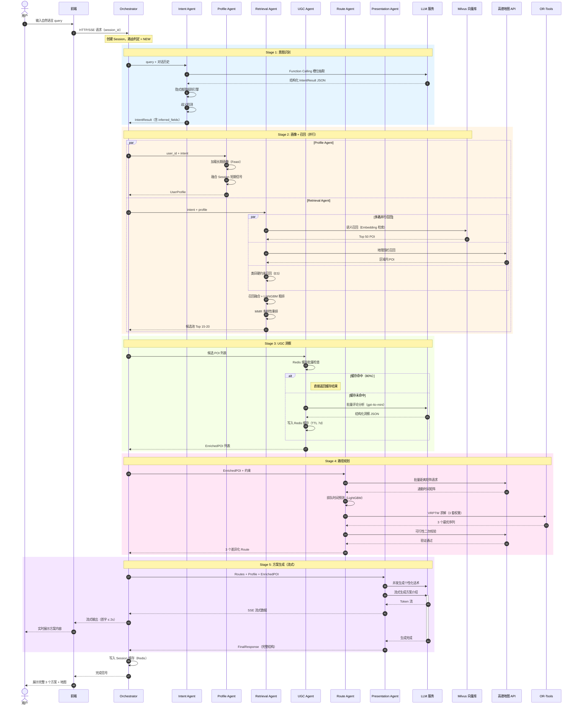
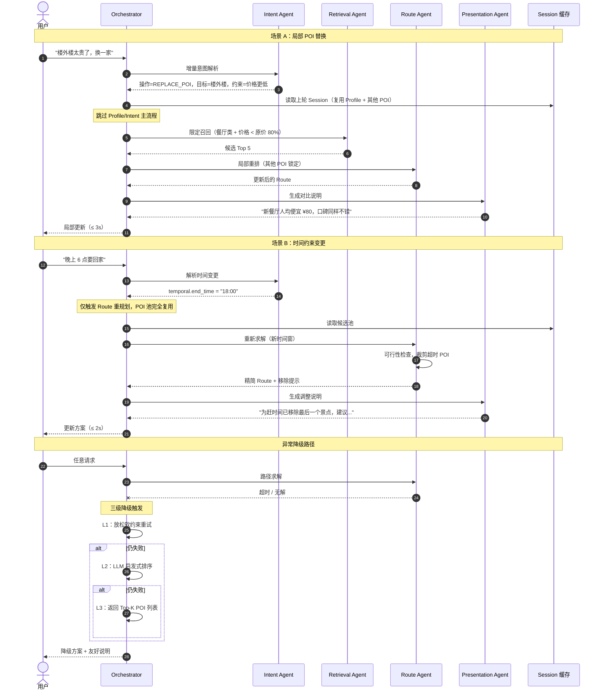
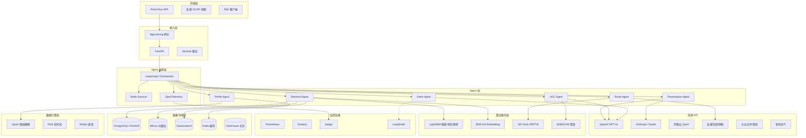

# SmartRoute Agent 系统 — 全 Agent 详细技术方案文档

> **文档版本**：v3.0（完整增强版）  
> **撰写日期**：2026-05-10  
> **覆盖内容**：系统总体架构、6 大核心 Agent + Orchestrator 详细方案、数据架构、生产级部署、评测体系、工具选型与开发里程碑

---

## 目录

1. [系统总体架构与设计原则](#一系统总体架构与设计原则)
2. [Orchestrator 主控调度器](#二orchestrator-主控调度器)
3. [Intent Agent 意图识别](#三intent-agent-意图识别)
4. [Profile Agent 用户画像](#四profile-agent-用户画像)
5. [Retrieval Agent POI 召回](#五retrieval-agent-poi-召回)
6. [UGC Insight Agent 评论洞察](#六ugc-insight-agent-评论洞察)
7. [Route Planning Agent 路径规划](#七route-planning-agent-路径规划)
8. [Presentation Agent 方案生成](#八presentation-agent-方案生成)
9. [数据架构与工程设计](#九数据架构与工程设计)
10. [生产级部署架构](#十生产级部署架构)
11. [评测体系设计](#十一评测体系设计)
12. [隐私合规设计](#十二隐私合规设计)
13. [全系统交互时序图](#十三全系统交互时序图)
14. [统一工具栈总览](#十四统一工具栈总览)
15. [开发优先级与里程碑](#十五开发优先级与里程碑)
16. [风险清单与应对策略](#十六风险清单与应对策略)

---

## 一、系统总体架构与设计原则

### 1.1 架构概述

SmartRoute Agent 系统采用**多 Agent 协同架构**，将复杂的路线规划任务分解为六个专职 Agent，由 Orchestrator 统一调度。整体架构遵循"单一职责、异步并行、降级兜底、成本感知"四大原则，在保证输出质量的同时控制系统延迟与 LLM 调用成本。

系统分为六个层次：**接入层**（API 网关、限流、认证）、**编排层**（LangGraph Orchestrator、Session 管理）、**Agent 层**（6 个专职 Agent）、**算法服务层**（Embedding、求解器、NLP 工具）、**外部 API 层**（LLM、地图、POI 数据源）和**数据存储层**（向量库、倒排索引、关系库、缓存、日志库）。

### 1.2 核心设计原则

**单一职责原则**：每个 Agent 只负责一个明确的子任务，Agent 间通过标准化 Schema 传递数据，避免职责耦合。Orchestrator 只负责调度，不承载任何业务逻辑。

**异步并行原则**：在数据依赖允许的情况下，最大化并行执行。Profile Agent 与 Retrieval Agent 在 Intent 完成后并行启动，可节省约 1-2 秒的串行等待时间。

**降级兜底原则**：每个 Agent 都设计有降级路径。单个 Agent 的失败不会导致整体服务不可用，系统会以降级质量返回部分结果，并向用户友好说明。

**成本感知原则**：LLM 调用按场景分层选型（高精度任务用 GPT-4o，批量处理用 GPT-4o-mini），并通过缓存机制避免重复计算。单次完整请求的 LLM 调用成本控制在 ¥0.10-0.20 以内。

### 1.3 系统分层架构图

```
┌─────────────────────────────────────────────────────────────────┐
│                          接入层                                  │
│   Nginx/Kong 网关  │  FastAPI 服务  │  Sentinel 限流  │  认证    │
├─────────────────────────────────────────────────────────────────┤
│                         编排层                                   │
│   LangGraph Orchestrator  │  Redis Session  │  OpenTelemetry    │
├─────────────────────────────────────────────────────────────────┤
│                         Agent 层                                 │
│  Intent │ Profile │ Retrieval │ UGC Insight │ Route │ Present   │
├─────────────────────────────────────────────────────────────────┤
│                       算法服务层                                  │
│  BGE Embedding  │  LightGBM  │  OR-Tools  │  HanLP  │  HDBSCAN │
├─────────────────────────────────────────────────────────────────┤
│                       外部 API 层                                │
│  OpenAI/Claude  │  高德/百度地图  │  大众点评/美团  │  天气 API  │
├─────────────────────────────────────────────────────────────────┤
│                       数据存储层                                  │
│  PostgreSQL  │  Milvus  │  Elasticsearch  │  Redis  │ClickHouse │
└─────────────────────────────────────────────────────────────────┘
```

### 1.4 关键数据流

系统的核心数据流为：用户自然语言输入 → Intent 结构化解析 → （Profile 画像 ‖ POI 多路召回）并行 → UGC 深度分析 → 路线优化求解 → 个性化方案生成 → 流式输出至前端。

各 Agent 间的数据传递通过 `SystemState` 统一管理，避免点对点耦合，所有中间结果均持久化到 Redis Session，支持多轮对话的上下文复用。

---

## 二、Orchestrator 主控调度器

### 2.1 模块定位

Orchestrator 是整个系统的"大脑指挥中心"，负责 Agent 间的调度、状态管理、异常处理与流式响应。它不承载任何业务逻辑，只负责"谁在什么时候执行、执行结果如何流转"。

### 2.2 核心职责

| 职责 | 说明 |
|-----|------|
| Agent 编排 | 决定哪些 Agent 执行、串行还是并行，构建执行 DAG |
| 状态管理 | 维护 Session、DialogState、跨轮次上下文 |
| 路由决策 | 根据请求类型路由到不同执行路径（NEW/MODIFY/REDO）|
| 异常处理 | 单点失败的降级策略、超时重试与备用模型切换 |
| 流式输出 | Token 级流式返回前端（SSE/WebSocket）|
| 链路追踪 | 全链路 trace_id 注入与性能监控 |
| 成本控制 | LLM Token 消耗统计与预算告警 |

### 2.3 调度策略矩阵

| 请求类型 | 触发条件 | 执行的 Agent | 预期耗时 |
|---------|---------|-------------|---------|
| NEW（首次）| 新 Session | 全部 6 个 Agent | ≤ 8s |
| MODIFY_POI（换 POI）| "把 X 换成 Y" | Retrieval + UGC + Route + Presentation | ≤ 3s |
| MODIFY_TIME（改时间）| "提前结束/延后出发" | Route + Presentation | ≤ 2s |
| MODIFY_PREFER（改偏好）| "想吃辣的" | Profile + Retrieval + Route + Presentation | ≤ 4s |
| REDO（完全重做）| "换个地方" | 全链路（复用 Profile 缓存）| ≤ 8s |
| CLARIFY（反问回答）| 用户补充信息 | Intent（增量）+ 后续链路 | ≤ 8s |

### 2.4 SystemState 设计

SystemState 是贯穿所有 Agent 的统一数据容器，采用 TypedDict 定义，所有 Agent 只读取自己需要的字段，只写入自己负责的字段：

```python
from typing import TypedDict, Optional, List
from dataclasses import dataclass

class SystemState(TypedDict):
    # 请求元信息
    session_id: str
    trace_id: str
    request_type: str           # NEW / MODIFY_POI / MODIFY_TIME / MODIFY_PREFER / REDO
    user_id: Optional[str]
    raw_query: str
    dialog_history: List[dict]  # 多轮对话历史

    # Intent Agent 输出
    intent: Optional[dict]      # IntentResult
    clarification_needed: bool  # 是否需要反问
    clarification_question: Optional[str]

    # Profile Agent 输出
    profile: Optional[dict]     # UserProfile
    profile_vector: Optional[List[float]]

    # Retrieval Agent 输出
    candidates: Optional[List[dict]]    # 候选 POI 列表
    retrieval_metadata: Optional[dict]  # 召回路径统计

    # UGC Agent 输出
    enriched_pois: Optional[List[dict]] # 增强后的 POI 列表

    # Route Agent 输出
    routes: Optional[List[dict]]        # 3 个差异化路线方案

    # Presentation Agent 输出
    final_response: Optional[dict]      # 最终输出结构

    # 运行时元数据
    error_info: Optional[dict]          # 错误信息
    fallback_triggered: bool            # 是否触发降级
    llm_cost_total: float               # 本次请求 LLM 成本
    stage_timings: dict                 # 各 Agent 耗时
```

### 2.5 LangGraph 执行图实现

```python
from langgraph.graph import StateGraph, END
from langgraph.checkpoint.redis import RedisSaver

def build_orchestrator_graph(checkpointer):
    graph = StateGraph(SystemState)

    # 注册所有 Agent 节点
    graph.add_node("router", request_router)
    graph.add_node("intent", intent_agent_node)
    graph.add_node("clarify", clarification_node)
    graph.add_node("profile", profile_agent_node)
    graph.add_node("retrieval", retrieval_agent_node)
    graph.add_node("parallel_merge", parallel_merge_node)
    graph.add_node("ugc", ugc_agent_node)
    graph.add_node("route", route_agent_node)
    graph.add_node("presentation", presentation_agent_node)
    graph.add_node("fallback", fallback_node)

    # 入口：路由判断
    graph.set_entry_point("router")

    # 条件路由：根据 request_type 决定执行路径
    graph.add_conditional_edges("router", route_decision_fn, {
        "NEW":            "intent",
        "MODIFY_POI":     "retrieval",
        "MODIFY_TIME":    "route",
        "MODIFY_PREFER":  "profile",
        "REDO":           "intent",
    })

    # Intent 完成后：检查是否需要反问
    graph.add_conditional_edges("intent", check_clarification, {
        "need_clarify": "clarify",
        "proceed":      "profile",  # 同时触发 profile 和 retrieval
    })

    # 反问后等待用户回答（外部事件触发重新进入）
    graph.add_edge("clarify", END)

    # Profile 和 Retrieval 并行执行（LangGraph 并行节点）
    graph.add_edge("profile", "parallel_merge")
    graph.add_edge("retrieval", "parallel_merge")

    # 并行合并后继续
    graph.add_edge("parallel_merge", "ugc")
    graph.add_edge("ugc", "route")

    # Route 完成后：检查是否有可行解
    graph.add_conditional_edges("route", check_route_feasibility, {
        "success":  "presentation",
        "fallback": "fallback",
    })

    graph.add_edge("presentation", END)
    graph.add_edge("fallback", "presentation")  # 降级后仍走 Presentation

    return graph.compile(checkpointer=checkpointer)


def route_decision_fn(state: SystemState) -> str:
    """根据请求类型决定执行路径"""
    return state.get("request_type", "NEW")


def check_clarification(state: SystemState) -> str:
    """检查 Intent Agent 是否需要反问"""
    if state.get("clarification_needed", False):
        return "need_clarify"
    return "proceed"


def check_route_feasibility(state: SystemState) -> str:
    """检查路线规划是否成功"""
    routes = state.get("routes", [])
    if routes and len(routes) > 0:
        return "success"
    return "fallback"
```

### 2.6 并行执行实现

Profile Agent 和 Retrieval Agent 需要并行执行以节省时间。LangGraph 通过 `Send` 机制支持并行节点，但更简洁的实现是在单个节点内使用 asyncio 并发：

```python
import asyncio

async def parallel_profile_retrieval_node(state: SystemState) -> SystemState:
    """并行执行 Profile 和 Retrieval，合并结果"""
    profile_task = asyncio.create_task(
        profile_agent_async(state["user_id"], state["intent"])
    )
    retrieval_task = asyncio.create_task(
        retrieval_agent_async(state["intent"], state.get("profile"))
    )

    # 并行等待，设置超时
    try:
        profile_result, retrieval_result = await asyncio.gather(
            profile_task, retrieval_task,
            return_exceptions=True
        )
    except asyncio.TimeoutError:
        # 超时降级：使用默认画像
        profile_result = get_default_profile(state["user_id"])
        retrieval_result = await retrieval_task

    state["profile"] = profile_result if not isinstance(profile_result, Exception) else get_default_profile(state["user_id"])
    state["candidates"] = retrieval_result if not isinstance(retrieval_result, Exception) else []
    return state
```

### 2.7 Session 状态管理

Session 状态存储在 Redis 中，以 `session_id` 为 key，TTL 设置为 24 小时：

```python
import redis
import json

class SessionManager:
    def __init__(self, redis_client: redis.Redis):
        self.redis = redis_client
        self.TTL = 86400  # 24 小时

    def save_state(self, session_id: str, state: SystemState):
        key = f"session:{session_id}"
        # 仅保存需要跨轮次复用的字段
        persist_fields = ["intent", "profile", "candidates", "enriched_pois",
                          "routes", "dialog_history", "user_id"]
        persist_data = {k: state[k] for k in persist_fields if k in state}
        self.redis.setex(key, self.TTL, json.dumps(persist_data, ensure_ascii=False))

    def load_state(self, session_id: str) -> dict:
        key = f"session:{session_id}"
        data = self.redis.get(key)
        if data:
            return json.loads(data)
        return {}

    def clear_session(self, session_id: str):
        self.redis.delete(f"session:{session_id}")
```

### 2.8 三级降级策略

| 降级级别 | 触发条件 | 处理方式 | 用户感知 |
|---------|---------|---------|---------|
| L1（软降级）| 单个 Agent 超时（>5s）| 使用缓存结果或默认值继续 | 无感知 |
| L2（部分降级）| 关键 Agent 失败（Route/UGC）| 跳过该 Agent，使用简化逻辑 | 提示"部分功能受限" |
| L3（完全降级）| 多个 Agent 失败 | 返回 Top-K POI 列表 + 原因说明 | 明确告知 |

### 2.9 技术选型

| 用途 | 推荐工具 | 备选 | 理由 |
|-----|---------|-----|------|
| **Agent 编排框架** | **LangGraph 0.2+** | AutoGen / CrewAI | 原生 DAG/状态机，可视化调试，支持 checkpoint |
| **状态存储** | Redis 7.x | Memcached | 低延迟，支持 TTL，原生 JSON 支持 |
| **流式协议** | SSE（Server-Sent Events）| WebSocket | LLM 流式输出标配，实现简单 |
| **API 框架** | FastAPI | Flask / Django | 原生 async，自动 OpenAPI 文档 |
| **链路追踪** | OpenTelemetry + Jaeger | Zipkin | 标准化分布式追踪，LangSmith 集成 |
| **监控告警** | Prometheus + Grafana | Datadog | LLM Token 消耗、Agent 延迟监控 |
| **限流熔断** | Sentinel | Resilience4j | 保护 LLM API，防止雪崩 |
| **LLM 监控** | LangSmith | PromptLayer | Prompt 版本管理 + 调用链追踪 |

---

## 三、Intent Agent 意图识别

### 3.1 模块定位

Intent Agent 是系统的**入口大脑**，将用户的自由文本转化为结构化指令。其输出质量直接决定整个 Pipeline 的天花板。该 Agent 需要处理三类复杂性：**语义歧义**（"附近"指哪里）、**隐式约束**（"带老人"隐含步行限制）和**多轮增量**（在已有意图基础上追加新约束）。

### 3.2 处理流水线

```
用户输入 query + 对话历史
    ↓
① 文本预处理（清洗/截断/敏感词过滤）
    ↓
② 上下文融合（DialogStateTracker：合并历史意图与新输入）
    ↓
③ 意图大类分类（轻量模型快速分类，10+ 类）
    ↓
④ 槽位抽取（LLM Function Calling，结构化 JSON 输出）
    ↓
⑤ 隐式推理（规则引擎：基于已抽取字段推断隐含约束）
    ↓
⑥ 歧义检测（置信度 < 阈值 → 生成反问）
    ↓
⑦ Schema 校验（Pydantic v2 验证）
    ↓
结构化 IntentResult
```

### 3.3 IntentResult Schema

```python
from pydantic import BaseModel, Field
from typing import Optional, List, Literal
from enum import Enum

class IntentType(str, Enum):
    TOUR = "tour"               # 景点游览
    FOOD_TOUR = "food_tour"     # 美食探索
    CITY_WALK = "city_walk"     # 城市漫步
    BUSINESS = "business"       # 商务出行
    DATE = "date"               # 约会
    FAMILY = "family"           # 家庭出游
    NATURE = "nature"           # 自然探索
    CULTURE = "culture"         # 文化历史

class SpatialConstraint(BaseModel):
    city: str                           # 城市（必填）
    region: Optional[str] = None        # 区域/商圈
    anchor_poi: Optional[str] = None    # 锚点 POI
    radius_km: Optional[float] = None   # 搜索半径（km）
    exclude_areas: List[str] = []       # 排除区域

class TemporalConstraint(BaseModel):
    date: str                           # 日期（YYYY-MM-DD）
    start_time: str = "09:00"           # 出发时间
    end_time: str = "18:00"             # 结束时间
    duration_hours: float = 8.0         # 总时长（小时）
    flexibility: Literal["strict", "flexible"] = "flexible"
    meal_preferences: List[str] = []    # 用餐时段偏好

class PartyInfo(BaseModel):
    size: int = 1                       # 人数
    composition: List[str] = []         # 构成：elder/child/adult/teen
    child_ages: List[int] = []          # 儿童年龄列表
    special_needs: List[str] = []       # 特殊需求：wheelchair/stroller

class Preferences(BaseModel):
    must_have: List[str] = []           # 必须包含的类型/主题
    nice_to_have: List[str] = []        # 希望包含
    avoid: List[str] = []               # 明确排除
    themes: List[str] = []              # 主题标签
    cuisine_types: List[str] = []       # 菜系偏好
    poi_style: Optional[str] = None     # popular/niche/balanced

class BudgetInfo(BaseModel):
    per_person: Optional[float] = None  # 人均预算（元）
    level: Optional[str] = None         # budget/mid/premium/luxury

class IntentResult(BaseModel):
    intent_type: IntentType
    confidence: float = Field(ge=0.0, le=1.0)
    spatial: SpatialConstraint
    temporal: TemporalConstraint
    party: PartyInfo
    preferences: Preferences
    budget: BudgetInfo
    ambiguity_flags: List[str] = []     # 需要反问的字段
    inferred_fields: List[str] = []     # 系统自动推断的字段
    raw_query: str                      # 原始输入留存
```

### 3.4 LLM Function Calling 实现

```python
import openai
from pydantic import ValidationError

INTENT_EXTRACTION_PROMPT = """
你是一个专业的出行意图解析助手。请从用户的输入中提取结构化的出行意图信息。

规则：
1. 仅提取用户明确表达或可以合理推断的信息，不要凭空捏造
2. 对于不确定的字段，留空而不是猜测
3. 注意识别隐式约束（如"带老人"暗示步行限制）
4. 日期如果是相对表达（"明天"、"这周六"），请转换为绝对日期

当前日期：{current_date}
对话历史：{dialog_history}
用户输入：{user_query}
"""

async def extract_intent(query: str, dialog_history: list, current_date: str) -> IntentResult:
    client = openai.AsyncOpenAI()

    response = await client.chat.completions.create(
        model="gpt-4o",
        messages=[
            {"role": "system", "content": INTENT_EXTRACTION_PROMPT.format(
                current_date=current_date,
                dialog_history=str(dialog_history[-3:]),  # 最近 3 轮
                user_query=query
            )}
        ],
        tools=[{
            "type": "function",
            "function": {
                "name": "extract_intent",
                "description": "提取用户出行意图的结构化信息",
                "parameters": IntentResult.model_json_schema()
            }
        }],
        tool_choice={"type": "function", "function": {"name": "extract_intent"}},
        temperature=0.1,    # 低温度保证稳定性
        max_tokens=1000,
    )

    tool_call = response.choices[0].message.tool_calls[0]
    raw_json = tool_call.function.arguments

    try:
        intent = IntentResult.model_validate_json(raw_json)
        return intent
    except ValidationError as e:
        # Schema 校验失败，触发重试或降级
        raise IntentExtractionError(f"Schema 校验失败: {e}") from e
```

### 3.5 隐式推理规则引擎

规则引擎采用 YAML 配置文件定义，支持热更新，无需重启服务：

```yaml
# implicit_rules.yaml
rules:
  - id: elder_walk_limit
    condition:
      field: party.composition
      contains: elder
    actions:
      - field: preferences.avoid
        append: 长距离步行
      - field: preferences.avoid
        append: 爬山
      - field: temporal.duration_hours
        max: 7.0
    description: 有老人时限制步行强度

  - id: toddler_indoor
    condition:
      field: party.child_ages
      any_less_than: 6
    actions:
      - field: preferences.nice_to_have
        append: 室内场所
      - field: preferences.nice_to_have
        append: 母婴室
      - field: preferences.avoid
        append: 长时间排队
    description: 有幼儿时优先室内场所

  - id: business_strict_time
    condition:
      field: raw_query
      contains_any: [出差, 商务, 会议]
    actions:
      - field: intent_type
        set: business
      - field: temporal.flexibility
        set: strict
    description: 商务场景时间严格

  - id: date_scene_upgrade
    condition:
      field: intent_type
      equals: date
    actions:
      - field: preferences.themes
        append: 浪漫氛围
      - field: budget.level
        default_if_empty: mid
    description: 约会场景自动提升氛围要求

  - id: default_duration
    condition:
      field: raw_query
      contains_any: [一日游, 全天]
    actions:
      - field: temporal.duration_hours
        set: 8.0
      - field: temporal.start_time
        default_if_empty: "09:00"
    description: 一日游默认 8 小时
```

```python
import yaml
from typing import Any

class ImplicitRuleEngine:
    def __init__(self, rules_path: str):
        self.rules = self._load_rules(rules_path)

    def _load_rules(self, path: str) -> list:
        with open(path, 'r', encoding='utf-8') as f:
            return yaml.safe_load(f)['rules']

    def apply(self, intent: IntentResult) -> IntentResult:
        """对 IntentResult 应用所有匹配的隐式推理规则"""
        intent_dict = intent.model_dump()
        triggered_rules = []

        for rule in self.rules:
            if self._check_condition(rule['condition'], intent_dict):
                self._apply_actions(rule['actions'], intent_dict)
                triggered_rules.append(rule['id'])

        # 记录被推断的字段
        intent_dict['inferred_fields'].extend(triggered_rules)
        return IntentResult.model_validate(intent_dict)

    def _check_condition(self, condition: dict, data: dict) -> bool:
        """检查规则条件是否满足（支持嵌套字段路径）"""
        field_value = self._get_nested(data, condition['field'])
        if 'contains' in condition:
            return condition['contains'] in (field_value or [])
        if 'contains_any' in condition:
            return any(kw in str(field_value or '') for kw in condition['contains_any'])
        if 'equals' in condition:
            return field_value == condition['equals']
        if 'any_less_than' in condition:
            return any(age < condition['any_less_than'] for age in (field_value or []))
        return False

    def _get_nested(self, data: dict, path: str) -> Any:
        """支持点分隔的嵌套字段路径，如 party.child_ages"""
        keys = path.split('.')
        for key in keys:
            if isinstance(data, dict):
                data = data.get(key)
            else:
                return None
        return data

    def _apply_actions(self, actions: list, data: dict):
        """执行规则动作，修改 intent_dict"""
        for action in actions:
            field_path = action['field'].split('.')
            target = data
            for key in field_path[:-1]:
                target = target.setdefault(key, {})
            last_key = field_path[-1]

            if 'append' in action:
                if last_key not in target:
                    target[last_key] = []
                if action['append'] not in target[last_key]:
                    target[last_key].append(action['append'])
            elif 'set' in action:
                target[last_key] = action['set']
            elif 'default_if_empty' in action:
                if not target.get(last_key):
                    target[last_key] = action['default_if_empty']
            elif 'max' in action:
                current = target.get(last_key)
                if current is None or current > action['max']:
                    target[last_key] = action['max']
```

### 3.6 歧义检测与反问生成

```python
AMBIGUITY_RULES = {
    "city_missing": {
        "condition": lambda intent: not intent.spatial.city,
        "question": "请问您计划在哪个城市游玩？",
        "priority": 1
    },
    "date_missing": {
        "condition": lambda intent: not intent.temporal.date,
        "question": "请问是哪天出行？",
        "priority": 2
    },
    "low_confidence": {
        "condition": lambda intent: intent.confidence < 0.7,
        "question": "我理解您想{intent_type}，请问还有其他具体要求吗？",
        "priority": 3
    },
    "time_poi_conflict": {
        "condition": lambda intent: (
            intent.temporal.duration_hours < 2 and
            len(intent.preferences.must_have) > 3
        ),
        "question": "您的时间较短但必去地点较多，是否可以减少必去景点，或延长游玩时间？",
        "priority": 1
    }
}

def detect_ambiguity(intent: IntentResult) -> tuple[bool, str]:
    """检测歧义，返回 (是否需要反问, 反问内容)"""
    triggered = []
    for rule_id, rule in AMBIGUITY_RULES.items():
        if rule["condition"](intent):
            triggered.append((rule["priority"], rule["question"]))

    if not triggered:
        return False, ""

    # 按优先级排序，最多取 2 个问题
    triggered.sort(key=lambda x: x[0])
    questions = [q for _, q in triggered[:2]]
    return True, " ".join(questions)
```

### 3.7 多轮增量意图合并

```python
def merge_intent_incremental(
    base_intent: IntentResult,
    new_intent: IntentResult,
    operation_type: str
) -> IntentResult:
    """
    将新一轮意图增量合并到已有意图上。
    operation_type: ADD（追加）/ REPLACE（替换）/ REMOVE（删除）
    """
    base_dict = base_intent.model_dump()
    new_dict = new_intent.model_dump()

    if operation_type == "ADD":
        # 追加模式：新字段补充到已有字段
        for key in ['must_have', 'nice_to_have', 'avoid', 'themes']:
            base_dict['preferences'][key] = list(set(
                base_dict['preferences'].get(key, []) +
                new_dict['preferences'].get(key, [])
            ))
    elif operation_type == "REPLACE":
        # 替换模式：新字段覆盖已有字段（仅覆盖非空字段）
        for key, value in new_dict.items():
            if value and value != base_dict.get(key):
                base_dict[key] = value
    elif operation_type == "REMOVE":
        # 删除模式：从 must_have 中移除指定项
        for item in new_dict['preferences'].get('avoid', []):
            if item in base_dict['preferences'].get('must_have', []):
                base_dict['preferences']['must_have'].remove(item)

    # 更新对话历史
    base_dict['dialog_history'] = base_dict.get('dialog_history', []) + [
        {"role": "user", "content": new_intent.raw_query}
    ]
    return IntentResult.model_validate(base_dict)
```

### 3.8 评测指标与基准

| 指标 | 目标值 | 评测方法 |
|-----|-------|---------|
| 字段抽取 F1 Score | ≥ 0.90 | 500 条人工标注测试集 |
| 意图分类准确率 | ≥ 0.92 | 分类标注集 |
| 隐式推理触发精确率 | ≥ 0.85 | 规则触发抽样人评 |
| 歧义检测误报率 | ≤ 10% | 清晰输入集测试 |
| 多轮一致性 | ≥ 0.88 | 多轮对话集 |
| 单次调用延迟 P95 | ≤ 1.5s | 压测 |

### 3.9 技术选型

| 用途 | 推荐工具 | 备注 |
|-----|---------|-----|
| **核心 LLM** | GPT-4o / Claude 3.5 Sonnet | Function Calling 能力强，准确度优先 |
| **轻量 LLM（粗分类）** | Qwen2.5-7B / GLM-4-Flash | 成本优化，本地化部署 |
| **Schema 校验** | Pydantic v2 | Python 标配，性能优秀 |
| **规则引擎** | 自研 YAML 解析器 | 支持热更新，运维友好 |
| **NER（地名/时间）** | HanLP 2.x / Stanza | 增强中文地理实体识别 |
| **Prompt 管理** | LangSmith | 版本管理 + A/B 测试 |
| **对话状态** | Redis Hash | session_id → DialogState |

---

## 四、Profile Agent 用户画像

### 4.1 模块定位

Profile Agent 基于用户历史行为构建**动态个性化偏好画像**，将用户的长期偏好与当前 Session 的短期信号融合，注入到 Retrieval 召回排序和 Presentation 话术生成中，实现"越用越懂你"的个性化体验。

### 4.2 画像架构

```
用户 ID + Session 信号
    ↓
① 长期画像加载（数仓 T+1 离线计算，Feast 特征服务）
    ↓
② 短期行为聚合（当前 Session 实时信号）
    ↓
③ 长短期融合（加权合并，默认 7:3）
    ↓
④ 冷启动判断（历史行为 < 5 次 → 走冷启动策略）
    ↓
⑤ 偏好向量化（BGE Embedding）
    ↓
UserProfile 输出
```

### 4.3 画像维度设计

| 维度 | 长期画像 | 短期画像 | 计算方式 | 用途 |
|-----|---------|---------|---------|------|
| 菜系偏好 | ✅ | ✅ | 历史下单 + Session 浏览加权 | 餐厅召回排序 |
| 消费档位 | ✅ | ✅ | 客单价中位数 | 预算校准 |
| 场景偏好 | ✅ | ❌ | 历史路线场景分布 | 路线风格匹配 |
| 步行耐受度 | ✅ | ❌ | 历史路线平均步行距离 | 步行约束设置 |
| 饮食禁忌 | ✅ | ❌ | 用户主动设置（硬约束）| 餐厅硬过滤 |
| 时段偏好 | ✅ | ❌ | 历史出行时段分布 | 时间安排优化 |
| POI 风格 | ✅ | ✅ | 历史访问 POI 的热度分布 | 网红/小众偏好 |
| 已去过的 POI | ✅ | ✅ | 历史足迹 + Session 选择 | 去重过滤 |
| 出行频率 | ✅ | ❌ | 月均出行次数 | 活跃度分层 |

### 4.4 UserProfile Schema

```python
from pydantic import BaseModel
from typing import Dict, List, Optional

class CuisinePreference(BaseModel):
    cuisine_type: str       # 菜系名称
    score: float            # 偏好分 0-1
    order_count: int        # 历史下单次数

class UserProfile(BaseModel):
    user_id: str
    is_cold_start: bool = False

    # 菜系偏好
    cuisine_preferences: List[CuisinePreference] = []

    # 消费档位（budget/mid/premium/luxury）
    spending_level: str = "mid"
    avg_spend_per_person: float = 100.0

    # 场景偏好标签（含权重）
    scene_preferences: Dict[str, float] = {}  # {"亲子": 0.8, "网红": 0.3}

    # 步行耐受度（km）
    walk_tolerance_km: float = 5.0

    # 饮食禁忌（硬约束）
    dietary_restrictions: List[str] = []  # ["海鲜", "花生"]

    # 时段偏好
    preferred_start_hour: int = 9   # 偏好出发时间
    is_night_owl: bool = False       # 是否偏好夜间活动

    # POI 风格偏好（0=网红, 1=小众）
    niche_preference_score: float = 0.5

    # 已去过的 POI（用于过滤）
    visited_poi_ids: List[str] = []

    # 画像向量（用于相似用户检索）
    profile_vector: Optional[List[float]] = None

    # 元数据
    data_freshness: str = ""    # 数据新鲜度（T+1 日期）
    confidence: float = 1.0     # 画像置信度（冷启动时较低）
```

### 4.5 长期偏好计算

长期偏好基于用户历史行为数据，采用**时间衰减加权**方式计算，近期行为权重更高：

$$P_{cuisine}(u, c) = \frac{\sum_{i \in H_u} w(t_i) \cdot \mathbb{1}(c_i = c)}{\sum_{i \in H_u} w(t_i)}$$

其中时间衰减权重为：$w(t_i) = e^{-\lambda(T - t_i)}$，$\lambda = 0.01$（约 100 天半衰期）。

```python
import numpy as np
from datetime import datetime, timedelta

def compute_cuisine_preference(
    order_history: list,  # [{"cuisine": "日料", "date": "2025-01-01", "amount": 150}, ...]
    current_date: datetime,
    decay_lambda: float = 0.01
) -> Dict[str, float]:
    """计算菜系偏好分，使用时间衰减加权"""
    cuisine_weights = {}
    total_weight = 0.0

    for order in order_history:
        order_date = datetime.strptime(order['date'], '%Y-%m-%d')
        days_ago = (current_date - order_date).days
        weight = np.exp(-decay_lambda * days_ago)

        cuisine = order['cuisine']
        cuisine_weights[cuisine] = cuisine_weights.get(cuisine, 0.0) + weight
        total_weight += weight

    if total_weight == 0:
        return {}

    # 归一化
    return {k: v / total_weight for k, v in cuisine_weights.items()}
```

### 4.6 长短期画像融合

```python
def merge_long_short_term_profile(
    long_term: UserProfile,
    short_term_signals: dict,  # Session 内的实时信号
    long_weight: float = 0.7,
    short_weight: float = 0.3
) -> UserProfile:
    """融合长期画像与短期 Session 信号"""
    merged = long_term.model_copy(deep=True)

    # 融合菜系偏好（短期信号权重更高）
    if 'browsed_cuisines' in short_term_signals:
        for cuisine in short_term_signals['browsed_cuisines']:
            for pref in merged.cuisine_preferences:
                if pref.cuisine_type == cuisine:
                    pref.score = long_weight * pref.score + short_weight * 1.0
                    break
            else:
                merged.cuisine_preferences.append(
                    CuisinePreference(cuisine_type=cuisine, score=short_weight, order_count=0)
                )

    # 融合已拒绝的 POI（Session 内负反馈）
    if 'rejected_poi_ids' in short_term_signals:
        merged.visited_poi_ids.extend(short_term_signals['rejected_poi_ids'])

    # 融合消费档位（Session 内明确表达的预算）
    if 'explicit_budget' in short_term_signals:
        merged.spending_level = short_term_signals['explicit_budget']

    return merged
```

### 4.7 冷启动策略

对于新用户（历史行为 < 5 次），系统采用三层冷启动策略：

**第一层：引导式偏好收集**。首次使用时展示偏好选择卡片，用户选择 3-5 个标签（如"喜欢小众""偏爱自然""美食达人"），选择结果立即写入画像，置信度设为 0.6。

**第二层：人群标签映射**。基于用户基本属性（城市、年龄段、性别）查找相似人群的偏好分布，作为初始画像。相似度基于 K 近邻（KNN）计算，从 Milvus 中检索最近邻用户群体。

**第三层：Session 内实时学习**。在当前对话中，用户的每次选择（接受/拒绝某个 POI、选择某种风格）都实时更新短期画像，影响后续推荐。

```python
async def get_cold_start_profile(
    user_id: str,
    user_attributes: dict,  # {"city": "杭州", "age_group": "25-35"}
    milvus_client,
    user_vector_collection: str
) -> UserProfile:
    """冷启动用户的画像构建"""

    # 查找相似人群（基于属性向量）
    attr_vector = encode_user_attributes(user_attributes)
    similar_users = await milvus_client.search(
        collection_name=user_vector_collection,
        data=[attr_vector],
        limit=50,
        output_fields=["user_id", "profile_data"]
    )

    # 聚合相似用户的偏好分布
    aggregated_profile = aggregate_group_preferences(
        [u['profile_data'] for u in similar_users[0]]
    )

    return UserProfile(
        user_id=user_id,
        is_cold_start=True,
        confidence=0.4,  # 冷启动置信度较低
        **aggregated_profile
    )
```

### 4.8 技术选型

| 用途 | 推荐工具 | 备注 |
|-----|---------|-----|
| **离线画像计算** | Spark 3.x | T+1 批量计算，支持大规模用户 |
| **实时特征计算** | Flink | Session 行为流处理 |
| **特征存储** | Feast + Redis | 在线低延迟特征服务 |
| **用户向量化** | BGE-M3 | 中文语义向量，支持多语言 |
| **相似用户检索** | Milvus IVF_FLAT | 高效 ANN 检索 |
| **协同过滤** | implicit（BPR/ALS）| 隐式反馈协同过滤 |
| **数据仓库** | Hive / ClickHouse | 历史行为存储 |
| **隐私保护** | 差分隐私库（Google DP）| 用户授权关闭个性化 |

### 4.9 评测指标

| 指标 | 目标值 |
|-----|-------|
| 画像覆盖率（有效画像用户占比）| ≥ 95% |
| 冷启动用户满意度 | ≥ 4.0/5.0 |
| 实时画像更新延迟 | ≤ 1s |
| 个性化推荐点击率提升（vs 非个性化）| ≥ 15% |

---

## 五、Retrieval Agent POI 召回

### 5.1 模块定位

Retrieval Agent 从海量 POI 库中**召回候选集**，是连接用户意图与路线规划的关键桥梁。其核心挑战在于：在满足地理约束的前提下，同时保证候选集的**相关性**（与意图匹配）、**多样性**（类目覆盖）和**个性化**（与用户画像匹配）。

### 5.2 多路召回架构

```
意图 IntentResult + 用户画像 UserProfile
    ↓
并行多路召回（5 路）
    ├─ 路 1：语义召回（Query Embedding → Milvus 向量检索）
    ├─ 路 2：地理召回（GeoHash + PostGIS 空间查询）
    ├─ 路 3：协同过滤召回（I2I / U2I 向量检索）
    ├─ 路 4：类目硬约束召回（Elasticsearch 倒排索引）
    └─ 路 5：热门兜底召回（城市/品类 Top 榜缓存）
    ↓
召回融合（去重 + 加权合并）
    ↓
粗排（LightGBM 特征打分）
    ↓
硬过滤（营业时间 / 饮食禁忌 / 已去过）
    ↓
MMR 多样性重排
    ↓
候选池 Top 15-50
```

### 5.3 各路召回设计

| 召回路 | 算法 | 召回量 | 核心用途 |
|-------|------|-------|---------|
| 语义召回 | Query Embedding + Milvus HNSW | 50 | 捕获意图主题（文艺/亲子/美食等）|
| 地理召回 | GeoHash + PostGIS ST_DWithin | 100 | 确保空间约束，限定地理范围 |
| 协同过滤 | ItemCF / User2Item 向量检索 | 30 | 个性化"猜你喜欢" |
| 类目召回 | ES 倒排索引 + 布尔查询 | 不限 | 满足硬约束（必须有某类 POI）|
| 热门兜底 | 城市/品类 Top 榜（Redis 缓存）| 20 | 冷启动兜底，保证候选集数量 |

### 5.4 语义召回实现

```python
from pymilvus import MilvusClient
import numpy as np

class SemanticRetriever:
    def __init__(self, milvus_client: MilvusClient, embed_model):
        self.milvus = milvus_client
        self.embed_model = embed_model
        self.collection = "poi_embeddings"

    async def retrieve(
        self,
        intent: IntentResult,
        profile: UserProfile,
        top_k: int = 50
    ) -> list:
        # 构建查询文本（融合意图和画像信息）
        query_text = self._build_query_text(intent, profile)

        # 生成查询向量
        query_vector = await self.embed_model.encode(query_text)

        # 构建过滤条件（地理范围 + 类目）
        filter_expr = self._build_filter(intent)

        # 向量检索
        results = await self.milvus.search(
            collection_name=self.collection,
            data=[query_vector.tolist()],
            limit=top_k,
            filter=filter_expr,
            output_fields=["poi_id", "name", "category", "location",
                           "avg_cost", "rating", "business_hours", "tags"],
            search_params={"metric_type": "COSINE", "params": {"ef": 200}}
        )

        return [self._parse_result(r) for r in results[0]]

    def _build_query_text(self, intent: IntentResult, profile: UserProfile) -> str:
        """构建融合意图和画像的查询文本"""
        parts = []

        # 意图主题
        if intent.preferences.themes:
            parts.append(" ".join(intent.preferences.themes))

        # 必须包含的类型
        if intent.preferences.must_have:
            parts.append(" ".join(intent.preferences.must_have))

        # 用户偏好场景
        top_scenes = sorted(profile.scene_preferences.items(),
                            key=lambda x: x[1], reverse=True)[:3]
        parts.extend([s[0] for s in top_scenes])

        # 意图类型描述
        intent_desc = {
            "tour": "景点游览 文化体验",
            "food_tour": "美食探索 特色餐厅",
            "city_walk": "城市漫步 街区探索",
            "date": "浪漫约会 精致环境",
            "family": "亲子友好 家庭活动"
        }
        parts.append(intent_desc.get(intent.intent_type, ""))

        return " ".join(filter(None, parts))

    def _build_filter(self, intent: IntentResult) -> str:
        """构建 Milvus 过滤表达式"""
        conditions = []

        # 城市过滤
        conditions.append(f'city == "{intent.spatial.city}"')

        # 预算过滤
        if intent.budget.per_person:
            max_cost = intent.budget.per_person * 1.2  # 允许 20% 超出
            conditions.append(f'avg_cost <= {max_cost}')

        return " and ".join(conditions) if conditions else ""
```

### 5.5 地理召回实现

```python
import asyncpg

class GeoRetriever:
    def __init__(self, pg_pool: asyncpg.Pool):
        self.pool = pg_pool

    async def retrieve(
        self,
        intent: IntentResult,
        top_k: int = 100
    ) -> list:
        # 确定搜索中心点和半径
        center_lat, center_lng = await self._resolve_anchor(intent)
        radius_km = intent.spatial.radius_km or self._default_radius(intent)

        async with self.pool.acquire() as conn:
            rows = await conn.fetch("""
                SELECT
                    poi_id, name, category, lat, lng,
                    avg_cost, rating, business_hours, tags,
                    ST_Distance(
                        ST_MakePoint($1, $2)::geography,
                        ST_MakePoint(lng, lat)::geography
                    ) / 1000.0 AS distance_km
                FROM pois
                WHERE
                    city = $3
                    AND ST_DWithin(
                        ST_MakePoint($1, $2)::geography,
                        ST_MakePoint(lng, lat)::geography,
                        $4 * 1000  -- 转换为米
                    )
                    AND is_active = true
                ORDER BY distance_km ASC
                LIMIT $5
            """, center_lng, center_lat, intent.spatial.city,
                radius_km, top_k)

        return [dict(row) for row in rows]

    def _default_radius(self, intent: IntentResult) -> float:
        """根据意图类型确定默认搜索半径"""
        radius_map = {
            "tour": 5.0,        # 景区游览，较小半径
            "food_tour": 3.0,   # 美食探索，集中区域
            "city_walk": 2.0,   # 城市漫步，步行范围
            "business": 3.0,    # 商务出行
        }
        return radius_map.get(intent.intent_type, 5.0)
```

### 5.6 粗排模型

粗排采用 LightGBM 模型，融合多维度特征进行打分：

$$Score(poi) = \alpha \cdot Sim_{sem} + \beta \cdot Match_{profile} + \gamma \cdot \log(1 + Pop) + \delta \cdot \frac{1}{1 + Dist}$$

其中各权重默认值：$\alpha=0.35, \beta=0.30, \gamma=0.20, \delta=0.15$。

```python
import lightgbm as lgb
import numpy as np

class CoarseRanker:
    def __init__(self, model_path: str):
        self.model = lgb.Booster(model_file=model_path)

    def rank(
        self,
        candidates: list,
        intent: IntentResult,
        profile: UserProfile
    ) -> list:
        features = [self._extract_features(poi, intent, profile)
                    for poi in candidates]
        feature_matrix = np.array(features)

        scores = self.model.predict(feature_matrix)

        # 将分数附加到候选列表
        for poi, score in zip(candidates, scores):
            poi['coarse_rank_score'] = float(score)

        return sorted(candidates, key=lambda x: x['coarse_rank_score'], reverse=True)

    def _extract_features(self, poi: dict, intent: IntentResult, profile: UserProfile) -> list:
        return [
            poi.get('semantic_similarity', 0.0),    # 语义相关度
            poi.get('distance_km', 10.0),            # 距离（km）
            poi.get('rating', 3.0),                  # 综合评分
            np.log1p(poi.get('review_count', 0)),    # 评论数（log）
            self._compute_profile_match(poi, profile), # 画像匹配度
            self._compute_budget_match(poi, intent),   # 预算匹配度
            1.0 if poi.get('poi_id') in profile.visited_poi_ids else 0.0,  # 是否去过
            self._compute_time_match(poi, intent),     # 营业时间匹配度
        ]

    def _compute_profile_match(self, poi: dict, profile: UserProfile) -> float:
        """计算 POI 与用户画像的匹配度"""
        score = 0.0
        poi_tags = set(poi.get('tags', []))

        # 场景偏好匹配
        for scene, weight in profile.scene_preferences.items():
            if scene in poi_tags:
                score += weight * 0.5

        # 消费档位匹配
        avg_cost = poi.get('avg_cost', 100)
        if profile.spending_level == 'budget' and avg_cost < 50:
            score += 0.3
        elif profile.spending_level == 'mid' and 50 <= avg_cost <= 200:
            score += 0.3
        elif profile.spending_level == 'premium' and avg_cost > 200:
            score += 0.3

        return min(score, 1.0)

    def _compute_budget_match(self, poi: dict, intent: IntentResult) -> float:
        if not intent.budget.per_person:
            return 1.0
        ratio = poi.get('avg_cost', 0) / intent.budget.per_person
        if ratio <= 1.0:
            return 1.0
        elif ratio <= 1.2:
            return 0.5
        else:
            return 0.0

    def _compute_time_match(self, poi: dict, intent: IntentResult) -> float:
        """检查营业时间是否覆盖出行时段"""
        # 简化版：实际实现需解析营业时间字符串
        return 1.0  # 占位，实际需实现时间解析逻辑
```

### 5.7 MMR 多样性重排

最大边际相关性（MMR）算法确保候选集的类目多样性：

```python
def mmr_rerank(
    candidates: list,
    lambda_param: float = 0.6,
    top_k: int = 20
) -> list:
    """
    MMR 多样性重排
    lambda_param: 相关性与多样性的权衡（越大越偏向相关性）
    """
    if not candidates:
        return []

    selected = []
    remaining = candidates.copy()

    # 第一个选最高分的
    best = max(remaining, key=lambda x: x['coarse_rank_score'])
    selected.append(best)
    remaining.remove(best)

    while len(selected) < top_k and remaining:
        best_mmr_score = -float('inf')
        best_candidate = None

        for candidate in remaining:
            # 相关性分数
            relevance = candidate['coarse_rank_score']

            # 与已选集合的最大相似度（类目相似度）
            max_sim = max(
                compute_category_similarity(candidate, sel)
                for sel in selected
            )

            # MMR 分数
            mmr_score = lambda_param * relevance - (1 - lambda_param) * max_sim

            if mmr_score > best_mmr_score:
                best_mmr_score = mmr_score
                best_candidate = candidate

        if best_candidate:
            selected.append(best_candidate)
            remaining.remove(best_candidate)

    return selected


def compute_category_similarity(poi_a: dict, poi_b: dict) -> float:
    """计算两个 POI 的类目相似度"""
    cat_a = poi_a.get('category', '')
    cat_b = poi_b.get('category', '')

    # 同一大类（餐厅/景点/购物）相似度高
    major_cat_a = cat_a.split('/')[0] if '/' in cat_a else cat_a
    major_cat_b = cat_b.split('/')[0] if '/' in cat_b else cat_b

    if major_cat_a == major_cat_b:
        return 0.8
    return 0.1
```

### 5.8 评测指标

| 指标 | 目标值 | 评测方法 |
|-----|-------|---------|
| Recall@50（相关 POI 召回率）| ≥ 95% | 离线标注集 |
| 召回延迟 P95 | ≤ 500ms | 压测（多路并行）|
| 类目多样性（候选集类目数）| ≥ 5 类 | 自动统计 |
| 个性化 NDCG@10 | ≥ 0.75 | 离线评测 |
| 硬约束满足率 | 100% | 自动校验 |

### 5.9 技术选型

| 用途 | 推荐工具 | 备注 |
|-----|---------|-----|
| **向量数据库** | Milvus 2.4 | HNSW 索引，支持标量过滤 |
| **Embedding 模型** | BGE-M3 | 中英文双语，1024 维 |
| **倒排引擎** | Elasticsearch 8.x | 类目/关键词召回 |
| **地理索引** | PostGIS 3.x | 空间查询，ST_DWithin |
| **粗排模型** | LightGBM 4.x | 轻量高效，支持在线推理 |
| **多样性算法** | MMR（自实现）| 类目多样性保证 |
| **缓存** | Redis 7.x | 热门 POI 列表缓存，TTL 1h |
| **POI 数据源** | 高德 POI API + 大众点评 | 国内主要数据源 |

---

## 六、UGC Insight Agent 评论洞察

### 6.1 模块定位

UGC Insight Agent 对候选 POI 的用户评论进行**深度结构化分析**，提供超越星级评分的细粒度决策依据。其核心价值在于将非结构化的 UGC 文本转化为可量化的多维度洞察，帮助路线规划模块做出更精准的 POI 选择和时间安排。

### 6.2 双通道处理架构

为平衡分析质量与成本，系统采用双通道策略：

```
候选 POI 列表
    ↓
① 缓存检查（Redis，TTL 7 天）→ 命中则直接返回
    ↓
② 评论拉取（近 3 月，按 POI 批量）
    ↓
③ 评论清洗（去广告/水军/重复）
    ↓
④ 路由判断（头部 POI → LLM 通道，长尾 → NLP 通道）
    ├─ LLM 通道（精度高，成本高）
    │     ├─ 维度化情感评分（食物/服务/环境/等待）
    │     ├─ 亮点/避雷提取
    │     ├─ 场景标签生成
    │     └─ 最佳游览时间推断
    └─ NLP 通道（成本低，快速）
          ├─ 情感分类（SnowNLP/HanLP）
          ├─ 关键词抽取（TF-IDF/TextRank）
          └─ 主题模型（BERTopic）
    ↓
⑤ 结果融合 + 时效加权（近期评论权重更高）
    ↓
⑥ 缓存写入（POI 维度，TTL 7 天）
    ↓
EnrichedPOI 列表
```

### 6.3 EnrichedPOI Schema

```python
class UGCSentiment(BaseModel):
    food: float = 0.0           # 食物/产品评分 0-5
    service: float = 0.0        # 服务评分 0-5
    environment: float = 0.0    # 环境评分 0-5
    wait_time: float = 0.0      # 等待时间评分 0-5（越高越短）
    value_for_money: float = 0.0 # 性价比评分 0-5

class EnrichedPOI(BaseModel):
    # 基础信息（继承自召回结果）
    poi_id: str
    name: str
    category: str
    location: dict
    avg_cost: float
    rating: float

    # UGC 洞察
    highlights: List[str] = []          # 亮点（≤3条）
    warnings: List[str] = []            # 避雷提示（≤3条）
    best_time: str = ""                 # 最佳游览时段
    crowd_match_score: float = 0.5      # 与当前用户群体的匹配度
    ugc_sentiment: UGCSentiment = UGCSentiment()
    scene_tags: List[str] = []          # 场景标签

    # 时间相关洞察
    peak_hours: List[str] = []          # 高峰时段（如 "12:00-13:00"）
    queue_warning: str = ""             # 排队预警（如 "周末排队 1h+"）
    estimated_duration_min: int = 60    # 建议游览时长（分钟）

    # 元数据
    analysis_channel: str = "nlp"       # llm / nlp
    data_freshness: str = ""            # 分析基于的最新评论日期
    review_count_analyzed: int = 0      # 分析的评论数量
    confidence: float = 0.8             # 分析置信度
```

### 6.4 LLM 通道实现

```python
UGC_ANALYSIS_PROMPT = """
你是一个专业的餐厅/景点评论分析师。请分析以下 POI 的用户评论，提取结构化洞察。

POI 信息：
- 名称：{poi_name}
- 类型：{poi_category}
- 综合评分：{rating}

近期评论（{review_count} 条，近 3 个月）：
{reviews_text}

请提取以下信息：
1. 亮点：最多 3 条，每条 15 字以内，聚焦用户最常提及的正面体验
2. 避雷：最多 3 条，每条 15 字以内，聚焦用户最常提及的问题
3. 最佳游览时段：基于评论推断（如"工作日午餐"、"周末避开 12-14 点"）
4. 维度评分：食物/服务/环境/等待时间，各 0-5 分
5. 场景标签：从以下选择适合的标签（可多选）：亲子友好、商务宴请、约会浪漫、独自用餐、聚会聚餐、夜宵、下午茶、快餐便餐
6. 排队预警：如有明显排队问题，请描述（如"周末排队 1h+"）

请以 JSON 格式输出，严格按照给定字段名。
"""

async def analyze_with_llm(
    poi: dict,
    reviews: list,
    llm_client
) -> dict:
    """使用 LLM 通道分析 POI 评论"""
    # 选取最近 50 条评论，优先低分评论（避雷更有价值）
    sorted_reviews = sorted(reviews, key=lambda r: (r.get('rating', 3), -r.get('timestamp', 0)))
    selected_reviews = sorted_reviews[:50]

    reviews_text = "\n".join([
        f"[{r.get('rating', '?')}星] {r.get('content', '')[:200]}"
        for r in selected_reviews
    ])

    response = await llm_client.chat.completions.create(
        model="gpt-4o-mini",  # 成本优化：使用 mini 版本
        messages=[{
            "role": "user",
            "content": UGC_ANALYSIS_PROMPT.format(
                poi_name=poi['name'],
                poi_category=poi['category'],
                rating=poi.get('rating', 'N/A'),
                review_count=len(selected_reviews),
                reviews_text=reviews_text
            )
        }],
        response_format={"type": "json_object"},
        temperature=0.2,
        max_tokens=800,
    )

    return json.loads(response.choices[0].message.content)
```

### 6.5 NLP 通道实现

```python
from snownlp import SnowNLP
import jieba
from collections import Counter

class NLPAnalyzer:
    """轻量 NLP 通道，用于长尾 POI 的低成本分析"""

    POSITIVE_KEYWORDS = ["好吃", "美味", "推荐", "不错", "满意", "惊艳", "值得", "环境好"]
    NEGATIVE_KEYWORDS = ["难吃", "贵", "排队", "慢", "差", "失望", "不推荐", "坑"]
    QUEUE_KEYWORDS = ["排队", "等位", "等了", "人多", "拥挤"]

    def analyze(self, poi: dict, reviews: list) -> dict:
        if not reviews:
            return self._empty_result()

        # 情感分析
        sentiments = [SnowNLP(r['content']).sentiments for r in reviews if r.get('content')]
        avg_sentiment = sum(sentiments) / len(sentiments) if sentiments else 0.5

        # 关键词提取
        all_text = " ".join([r.get('content', '') for r in reviews])
        words = jieba.cut(all_text)
        word_freq = Counter(w for w in words if len(w) >= 2)

        # 亮点（高频正面词）
        highlights = [w for w, _ in word_freq.most_common(20)
                      if any(kw in w for kw in self.POSITIVE_KEYWORDS)][:3]

        # 避雷（高频负面词）
        warnings = [w for w, _ in word_freq.most_common(20)
                    if any(kw in w for kw in self.NEGATIVE_KEYWORDS)][:3]

        # 排队预警
        queue_mentions = sum(1 for r in reviews
                             if any(kw in r.get('content', '') for kw in self.QUEUE_KEYWORDS))
        queue_warning = f"约 {queue_mentions/len(reviews)*100:.0f}% 评论提到排队" if queue_mentions > 3 else ""

        return {
            "highlights": highlights,
            "warnings": warnings,
            "queue_warning": queue_warning,
            "ugc_sentiment": {
                "food": min(5.0, avg_sentiment * 5),
                "service": min(5.0, avg_sentiment * 5),
                "environment": min(5.0, avg_sentiment * 5),
                "wait_time": 5.0 - (queue_mentions / len(reviews) * 5) if reviews else 3.0,
            },
            "analysis_channel": "nlp"
        }
```

### 6.6 痛点聚类（差评分析）

对差评（≤3 星）进行聚类，提取共性问题：

```python
from sentence_transformers import SentenceTransformer
import hdbscan
import numpy as np

class PainPointClustering:
    def __init__(self, embed_model: SentenceTransformer):
        self.embed_model = embed_model

    def cluster_negative_reviews(self, reviews: list, min_cluster_size: int = 3) -> list:
        """对差评进行聚类，提取共性痛点"""
        negative_reviews = [r for r in reviews if r.get('rating', 5) <= 3]
        if len(negative_reviews) < min_cluster_size:
            return []

        texts = [r['content'][:200] for r in negative_reviews]

        # 文本向量化
        embeddings = self.embed_model.encode(texts, normalize_embeddings=True)

        # HDBSCAN 聚类（无需预设类别数）
        clusterer = hdbscan.HDBSCAN(
            min_cluster_size=min_cluster_size,
            metric='euclidean',
            cluster_selection_epsilon=0.3
        )
        labels = clusterer.fit_predict(embeddings)

        # 整理聚类结果
        clusters = {}
        for text, label in zip(texts, labels):
            if label == -1:  # 噪声点
                continue
            clusters.setdefault(label, []).append(text)

        # 每个聚类生成摘要（可用 LLM 或 TextRank）
        pain_points = []
        for cluster_id, cluster_texts in clusters.items():
            summary = self._summarize_cluster(cluster_texts)
            pain_points.append({
                "cluster_id": cluster_id,
                "count": len(cluster_texts),
                "summary": summary
            })

        return sorted(pain_points, key=lambda x: x['count'], reverse=True)

    def _summarize_cluster(self, texts: list) -> str:
        """用 TextRank 或 LLM 生成聚类摘要"""
        # 简化版：取最具代表性的一句话
        return texts[0][:50] + "..." if texts else ""
```

### 6.7 缓存策略

```python
class UGCCacheManager:
    def __init__(self, redis_client: redis.Redis):
        self.redis = redis_client
        self.TTL = 7 * 24 * 3600  # 7 天

    def get_cached(self, poi_id: str) -> Optional[dict]:
        key = f"ugc:poi:{poi_id}"
        data = self.redis.get(key)
        return json.loads(data) if data else None

    def set_cache(self, poi_id: str, analysis: dict):
        key = f"ugc:poi:{poi_id}"
        self.redis.setex(key, self.TTL, json.dumps(analysis, ensure_ascii=False))

    def batch_get(self, poi_ids: list) -> tuple[dict, list]:
        """批量获取缓存，返回 (命中结果, 未命中 poi_id 列表)"""
        pipe = self.redis.pipeline()
        for poi_id in poi_ids:
            pipe.get(f"ugc:poi:{poi_id}")
        results = pipe.execute()

        cached = {}
        missed = []
        for poi_id, result in zip(poi_ids, results):
            if result:
                cached[poi_id] = json.loads(result)
            else:
                missed.append(poi_id)

        return cached, missed
```

### 6.8 评测指标

| 指标 | 目标值 | 评测方法 |
|-----|-------|---------|
| 观点抽取准确率 | ≥ 85% | 人工标注 200 条 |
| 痛点合理性（人评）| ≥ 4.0/5.0 | 抽样人工评估 |
| 缓存命中率 | ≥ 80% | 系统统计 |
| 单 POI 处理成本（LLM 通道）| ≤ ¥0.05 | 成本统计 |
| 单 POI 处理延迟（LLM 通道）| ≤ 2s | 压测 |
| 水军识别召回率 | ≥ 90% | 标注集测试 |

### 6.9 技术选型

| 用途 | 推荐工具 | 备注 |
|-----|---------|-----|
| **核心 LLM（LLM 通道）** | GPT-4o-mini / Qwen-Plus | 成本敏感，批量处理 |
| **中文情感分析** | SnowNLP / HanLP | 轻量，无需 GPU |
| **细粒度情感（ABSA）** | PyABSA | 维度级情感分析 |
| **关键词抽取** | jieba + TF-IDF | 中文分词 + 关键词 |
| **主题模型** | BERTopic | 基于 BERT 的主题建模 |
| **痛点聚类** | HDBSCAN | 无需预设类别数 |
| **文本向量化** | BGE-Small-ZH | 轻量中文向量模型 |
| **缓存** | Redis（TTL 7 天）| 降本核心手段 |
| **批处理** | Ray | 大规模评论离线处理 |

---

## 七、Route Planning Agent 路径规划

### 7.1 模块定位

Route Planning Agent 是系统的**决策核心**，在多重约束下求解"看起来合理、走起来舒服"的 POI 访问序列。其核心挑战是在 NP-Hard 的组合优化问题（VRPTW）上，在 2 秒内生成多个高质量的差异化方案。

### 7.2 问题建模

路线规划问题被建模为**带时间窗的旅行商问题（VRPTW）**：

**目标函数（多目标加权）**：

$$\min Z = w_1 T_{travel} + w_2 T_{wait} - w_3 S_{exp} + w_4 C_{cost}$$

其中：
- $T_{travel}$：总交通时间（分钟）
- $T_{wait}$：总排队等待时间（分钟）
- $S_{exp}$：综合体验得分（UGC 评分加权）
- $C_{cost}$：总费用（元）

**硬约束**：

| 约束 | 数学表达 | 说明 |
|-----|---------|------|
| 时间窗 | $open_i \le t_i \le close_i - s_i$ | 到达时间在营业时间内 |
| 用餐约束 | $\exists i \in Route: cat_i = restaurant \land t_i \in [11:30, 13:30]$ | 必有午餐 |
| 步行上限 | $\sum_{i} walk_i \le MAX\_WALK$ | 控制体力消耗 |
| 预算上限 | $\sum_{i} cost_i \le Budget$ | 不超预算 |
| 末班交通 | $t_{end} \le T_{last\_transit}$ | 赶上末班车 |

### 7.3 求解器选择策略

根据候选 POI 数量选择不同的求解策略：

| 场景 | POI 数量 | 求解器 | 预期耗时 |
|-----|---------|-------|---------|
| 小规模 | ≤ 6 | 暴力枚举 + 剪枝 | < 100ms |
| 中等规模 | 6-15 | Google OR-Tools VRPTW | < 1s |
| 大规模 | > 15 | 模拟退火 / 遗传算法 | < 2s |
| 兜底 | 任意 | LLM 启发式排序 | < 3s |

### 7.4 OR-Tools 实现

```python
from ortools.constraint_solver import routing_enums_pb2
from ortools.constraint_solver import pywrapcp
import numpy as np

class VRPTWSolver:
    def __init__(self, map_api_client):
        self.map_api = map_api_client

    async def solve(
        self,
        pois: list,
        intent: IntentResult,
        profile: UserProfile,
        weights: dict  # {"travel": 0.3, "wait": 0.2, "experience": 0.4, "cost": 0.1}
    ) -> Optional[list]:
        """
        使用 OR-Tools 求解 VRPTW 问题
        返回 POI 访问序列（含时间安排），无解返回 None
        """
        n = len(pois)
        if n == 0:
            return None

        # 构建距离矩阵（含时段感知）
        distance_matrix = await self._build_distance_matrix(pois, intent)

        # 构建时间窗矩阵
        time_windows = self._build_time_windows(pois, intent)

        # 构建 OR-Tools 数据模型
        data = self._create_data_model(distance_matrix, time_windows, pois, intent)

        # 创建路由模型
        manager = pywrapcp.RoutingIndexManager(len(data['time_matrix']), 1, 0)
        routing = pywrapcp.RoutingModel(manager)

        # 时间维度
        def time_callback(from_index, to_index):
            from_node = manager.IndexToNode(from_index)
            to_node = manager.IndexToNode(to_index)
            return data['time_matrix'][from_node][to_node]

        transit_callback_index = routing.RegisterTransitCallback(time_callback)
        routing.SetArcCostEvaluatorOfAllVehicles(transit_callback_index)

        # 添加时间窗约束
        time = 'Time'
        routing.AddDimension(
            transit_callback_index,
            30,   # 允许等待时间（分钟）
            data['total_duration'],  # 最大时间
            False,
            time
        )
        time_dimension = routing.GetDimensionOrDie(time)

        for location_idx, time_window in enumerate(data['time_windows']):
            if location_idx == data['depot']:
                continue
            index = manager.NodeToIndex(location_idx)
            time_dimension.CumulVar(index).SetRange(time_window[0], time_window[1])

        # 求解参数
        search_parameters = pywrapcp.DefaultRoutingSearchParameters()
        search_parameters.first_solution_strategy = (
            routing_enums_pb2.FirstSolutionStrategy.PATH_CHEAPEST_ARC
        )
        search_parameters.local_search_metaheuristic = (
            routing_enums_pb2.LocalSearchMetaheuristic.GUIDED_LOCAL_SEARCH
        )
        search_parameters.time_limit.FromSeconds(2)  # 2 秒时间限制

        # 求解
        solution = routing.SolveWithParameters(search_parameters)

        if solution:
            return self._extract_solution(manager, routing, solution, pois, data)
        return None

    async def _build_distance_matrix(self, pois: list, intent: IntentResult) -> list:
        """构建 POI 间的时间距离矩阵（考虑交通方式和时段）"""
        n = len(pois)
        matrix = [[0] * n for _ in range(n)]

        # 批量请求地图 API（减少 API 调用次数）
        origins = [(p['location']['lat'], p['location']['lng']) for p in pois]
        destinations = origins.copy()

        # 使用高德路线矩阵 API
        travel_times = await self.map_api.distance_matrix(
            origins=origins,
            destinations=destinations,
            mode=self._select_transport_mode(intent),
            departure_time=intent.temporal.start_time
        )

        for i in range(n):
            for j in range(n):
                if i != j:
                    matrix[i][j] = travel_times[i][j]  # 分钟

        return matrix

    def _build_time_windows(self, pois: list, intent: IntentResult) -> list:
        """构建每个 POI 的时间窗（营业时间 + 出行时段交集）"""
        start_minutes = self._time_to_minutes(intent.temporal.start_time)
        end_minutes = self._time_to_minutes(intent.temporal.end_time)

        time_windows = [(start_minutes, end_minutes)]  # depot（起点）

        for poi in pois:
            open_time, close_time = self._parse_business_hours(poi['business_hours'])
            # 取营业时间与出行时段的交集
            window_start = max(open_time, start_minutes)
            window_end = min(close_time - poi.get('estimated_duration_min', 60), end_minutes)

            if window_start >= window_end:
                # 时间窗无效，给一个宽松的窗口（后续校验会过滤）
                time_windows.append((start_minutes, end_minutes))
            else:
                time_windows.append((window_start, window_end))

        return time_windows

    def _time_to_minutes(self, time_str: str) -> int:
        """将 HH:MM 格式转换为分钟数"""
        h, m = map(int, time_str.split(':'))
        return h * 60 + m

    def _select_transport_mode(self, intent: IntentResult) -> str:
        """根据意图选择交通方式"""
        if intent.party.special_needs and 'wheelchair' in intent.party.special_needs:
            return 'driving'
        if intent.intent_type == 'city_walk':
            return 'walking'
        return 'transit'  # 默认公共交通
```

### 7.5 多方案差异化生成

系统通过不同的权重组合生成 3 个差异化方案，并保证方案间的 POI 重叠率 ≤ 50%：

```python
PLAN_CONFIGS = [
    {
        "name": "经典稳妥",
        "tagline": "兼顾体验与效率，适合首次到访",
        "weights": {"travel": 0.3, "wait": 0.2, "experience": 0.4, "cost": 0.1}
    },
    {
        "name": "避峰省时",
        "tagline": "规避排队高峰，时间利用率最高",
        "weights": {"travel": 0.2, "wait": 0.5, "experience": 0.2, "cost": 0.1}
    },
    {
        "name": "极致体验",
        "tagline": "不惜排队，追求最佳体验",
        "weights": {"travel": 0.1, "wait": 0.1, "experience": 0.7, "cost": 0.1}
    }
]

async def generate_multi_plans(
    pois: list,
    intent: IntentResult,
    profile: UserProfile,
    solver: VRPTWSolver
) -> list:
    """生成 3 个差异化路线方案"""
    plans = []
    used_poi_sets = []

    for config in PLAN_CONFIGS:
        # 根据权重对 POI 进行重新排序（影响候选集构成）
        weighted_pois = rerank_pois_by_weights(pois, config['weights'])

        # 确保与已有方案的差异度
        if used_poi_sets:
            weighted_pois = ensure_diversity(weighted_pois, used_poi_sets, max_overlap=0.5)

        # 求解路线
        route = await solver.solve(weighted_pois[:15], intent, profile, config['weights'])

        if route:
            plan = {
                "name": config['name'],
                "tagline": config['tagline'],
                "route": route,
                "weights": config['weights']
            }
            plans.append(plan)
            used_poi_sets.append(set(poi['poi_id'] for poi in route))

    # 如果某个方案求解失败，用 LLM 兜底
    while len(plans) < 3:
        fallback_plan = await llm_fallback_plan(pois, intent, profile, len(plans))
        if fallback_plan:
            plans.append(fallback_plan)
        else:
            break

    return plans


def ensure_diversity(candidates: list, used_sets: list, max_overlap: float = 0.5) -> list:
    """调整候选集，确保与已有方案的差异度"""
    candidate_ids = set(p['poi_id'] for p in candidates)

    for used_set in used_sets:
        overlap = len(candidate_ids & used_set) / max(len(candidate_ids), 1)
        if overlap > max_overlap:
            # 替换部分重叠 POI
            overlap_ids = candidate_ids & used_set
            candidates = [p for p in candidates if p['poi_id'] not in list(overlap_ids)[:3]]

    return candidates
```

### 7.6 排队时间预测

```python
import lightgbm as lgb

class QueueTimePredictor:
    """基于历史数据预测 POI 在特定时段的排队时间"""

    def __init__(self, model_path: str):
        self.model = lgb.Booster(model_file=model_path)

    def predict(self, poi_id: str, visit_datetime: datetime) -> int:
        """预测排队时间（分钟）"""
        features = self._extract_features(poi_id, visit_datetime)
        predicted_minutes = self.model.predict([features])[0]
        return max(0, int(predicted_minutes))

    def _extract_features(self, poi_id: str, dt: datetime) -> list:
        return [
            dt.weekday(),               # 星期几（0=周一）
            dt.hour,                    # 小时
            dt.month,                   # 月份
            1 if dt.weekday() >= 5 else 0,  # 是否周末
            self._is_holiday(dt),       # 是否节假日
            # 更多特征：天气、历史均值等
        ]

    def _is_holiday(self, dt: datetime) -> int:
        # 接入节假日 API 或本地节假日数据
        return 0  # 占位
```

### 7.7 可行性校验清单

路线方案在输出前需通过以下全部校验：

| 校验项 | 校验方式 | 不通过处理 |
|-------|---------|---------|
| 营业时间 100% 满足 | 逐 POI 检查时间窗 | 调整访问时间或替换 POI |
| 餐厅落在用餐时段 | 检查餐厅类 POI 的到达时间 | 重新排序 |
| 总步行 ≤ 体力上限 | 累加步行距离 | 替换远距离 POI |
| 末班交通时间满足 | 查询末班车时刻 | 截短路线 |
| 地图 API 二次验证 | 调用路线规划 API 验证可达性 | 替换不可达路段 |
| 预算不超限 | 累加各 POI 费用 | 替换高价 POI |

### 7.8 评测指标

| 指标 | 目标值 |
|-----|-------|
| 营业时间满足率 | 100% |
| 用户方案采纳率 | ≥ 60% |
| 时间预估误差（实际 vs 预测）| ≤ 15% |
| 求解时间 P95 | ≤ 2s |
| 多方案 POI 重叠率 | ≤ 50% |
| 降级触发率 | ≤ 5% |

### 7.9 技术选型

| 用途 | 推荐工具 | 备注 |
|-----|---------|-----|
| **核心求解器** | Google OR-Tools 9.x | VRPTW 工业级求解，Python 原生 |
| **启发式算法** | DEAP（遗传算法）| 大规模场景 |
| **模拟退火** | scipy.optimize | 标准库，快速集成 |
| **地图距离矩阵** | 高德路线矩阵 API | 国内首选，支持多模式 |
| **自建路由**（高 QPS）| OSRM | 降低地图 API 成本 |
| **公交规划** | 高德 Transit API | 多模式交通 |
| **排队预测** | LightGBM + 历史数据 | 时序回归 |
| **天气影响** | 和风天气 API | 影响排队和体验 |
| **LLM 兜底** | GPT-4o | 软约束推理，偶发使用 |

---

## 八、Presentation Agent 方案生成

### 8.1 模块定位

Presentation Agent 将路线规划结果转化为**用户友好的展示内容**，是系统"最后一公里"的体验保障。其核心价值在于：将结构化数据转化为自然、个性化的语言，让用户感受到"这个方案是为我量身定制的"。

### 8.2 处理流水线

```
3 个 Route + UserProfile + EnrichedPOI
    ↓
① 方案差异点提取（A vs B vs C 对比矩阵）
    ↓
② 个性化话术生成（基于用户画像注入 Prompt）
    ├─ 每个 POI 的推荐理由（1-2 句，结合画像）
    ├─ 时间安排解释（"避开排队高峰"）
    └─ 整体方案概述（风格定位 + 适合人群）
    ↓
③ 多模态渲染数据组装
    ├─ Markdown 文本（纯文本展示）
    ├─ 卡片 JSON（前端富文本渲染）
    └─ 地图标注数据（POI 坐标 + 路线）
    ↓
④ 可调整提示生成（主动提示用户可以怎么调整）
    ↓
⑤ 流式输出（SSE，首字 ≤ 2s）
```

### 8.3 最终输出 Schema

```python
class POITimelineItem(BaseModel):
    poi_id: str
    poi_name: str
    category: str
    arrive_time: str            # "09:30"
    leave_time: str             # "11:00"
    duration_min: int           # 建议游览时长（分钟）
    transport_to_next: dict     # {"mode": "步行", "duration_min": 15, "distance_m": 800}
    estimated_cost: float       # 预估费用（元/人）
    why_for_you: str            # 个性化推荐理由
    highlights: List[str]       # 来自 UGC 的亮点
    warnings: List[str]         # 来自 UGC 的注意事项
    queue_warning: str          # 排队预警

class RoutePlan(BaseModel):
    plan_id: str                # "plan_a" / "plan_b" / "plan_c"
    name: str                   # "经典稳妥"
    tagline: str                # "稳妥之选，适合首次到访"
    highlights: List[str]       # 方案亮点（3 条）
    timeline: List[POITimelineItem]
    summary: dict               # {"total_distance_km": 8.5, "total_cost": 450, "total_duration_h": 8}
    why_for_you: str            # 整体个性化说明
    map_data: dict              # 地图渲染数据

class FinalResponse(BaseModel):
    session_id: str
    summary: str                # "为您定制了 3 套西湖一日游方案..."
    plans: List[RoutePlan]
    plan_comparison: dict       # 方案对比矩阵
    adjustable_hints: List[str] # 可调整提示
    metadata: dict              # 生成时间、成本等
```

### 8.4 个性化话术生成

```python
PERSONALIZED_REASON_PROMPT = """
你是一个贴心的旅行顾问。请为用户生成一段个性化的 POI 推荐理由。

用户画像：
- 菜系偏好：{cuisine_preferences}
- 消费档位：{spending_level}
- 场景偏好：{scene_preferences}
- 出行人员：{party_composition}

POI 信息：
- 名称：{poi_name}
- 类型：{poi_category}
- 人均消费：{avg_cost} 元
- 亮点：{highlights}
- 场景标签：{scene_tags}

要求：
1. 1-2 句话，不超过 60 字
2. 必须结合用户画像，体现个性化（不要写通用推荐语）
3. 语气自然、亲切，像朋友推荐
4. 如果 POI 与用户偏好有差异，要给出合理解释

示例输出："虽然你平时偏爱日料，但带父母游西湖，楼外楼是品尝正宗杭帮菜的首选，环境也适合长辈用餐。"
"""

async def generate_personalized_reasons(
    plans: list,
    profile: UserProfile,
    enriched_pois: dict,  # poi_id -> EnrichedPOI
    llm_client
) -> list:
    """为所有方案中的 POI 生成个性化推荐理由"""

    # 批量生成（减少 API 调用次数）
    all_pois = []
    for plan in plans:
        for item in plan['route']:
            poi_id = item['poi_id']
            if poi_id not in [p['poi_id'] for p in all_pois]:
                all_pois.append({
                    'poi_id': poi_id,
                    'poi': enriched_pois.get(poi_id, {})
                })

    # 并发生成（每个 POI 独立调用）
    import asyncio
    tasks = [
        generate_single_reason(poi_data['poi'], profile, llm_client)
        for poi_data in all_pois
    ]
    reasons = await asyncio.gather(*tasks)

    reason_map = {
        poi_data['poi_id']: reason
        for poi_data, reason in zip(all_pois, reasons)
    }

    # 将推荐理由注入到方案中
    for plan in plans:
        for item in plan['route']:
            item['why_for_you'] = reason_map.get(item['poi_id'], "")

    return plans


async def generate_single_reason(poi: dict, profile: UserProfile, llm_client) -> str:
    """为单个 POI 生成个性化推荐理由"""
    prompt = PERSONALIZED_REASON_PROMPT.format(
        cuisine_preferences=", ".join([p.cuisine_type for p in profile.cuisine_preferences[:3]]),
        spending_level=profile.spending_level,
        scene_preferences=", ".join(list(profile.scene_preferences.keys())[:3]),
        party_composition=", ".join(["老人" if "elder" in str(profile) else "成人"]),
        poi_name=poi.get('name', ''),
        poi_category=poi.get('category', ''),
        avg_cost=poi.get('avg_cost', 0),
        highlights=", ".join(poi.get('highlights', [])[:2]),
        scene_tags=", ".join(poi.get('scene_tags', [])[:3])
    )

    response = await llm_client.chat.completions.create(
        model="gpt-4o",
        messages=[{"role": "user", "content": prompt}],
        temperature=0.7,
        max_tokens=100,
    )

    return response.choices[0].message.content.strip()
```

### 8.5 流式输出实现

```python
from fastapi import FastAPI
from fastapi.responses import StreamingResponse
import asyncio
import json

async def stream_presentation(
    plans: list,
    profile: UserProfile,
    llm_client
):
    """流式生成方案展示内容"""

    STREAM_PROMPT = """
    请为用户生成一份完整的路线方案介绍。要求：
    1. 先用 2-3 句话总结整体方案
    2. 依次介绍 3 个方案，每个方案包含：名称、亮点、时间安排概述
    3. 语气自然、有温度，像朋友在聊天

    方案数据：{plans_json}
    用户画像：{profile_summary}
    """

    async def generate():
        # 先发送结构化数据（非流式）
        yield f"data: {json.dumps({'type': 'structured', 'plans': plans}, ensure_ascii=False)}\n\n"

        # 再流式生成自然语言介绍
        stream = await llm_client.chat.completions.create(
            model="gpt-4o",
            messages=[{
                "role": "user",
                "content": STREAM_PROMPT.format(
                    plans_json=json.dumps(plans, ensure_ascii=False)[:2000],
                    profile_summary=f"偏好：{profile.scene_preferences}"
                )
            }],
            stream=True,
            temperature=0.7,
            max_tokens=1500,
        )

        async for chunk in stream:
            if chunk.choices[0].delta.content:
                token = chunk.choices[0].delta.content
                yield f"data: {json.dumps({'type': 'text', 'token': token}, ensure_ascii=False)}\n\n"

        yield "data: [DONE]\n\n"

    return StreamingResponse(generate(), media_type="text/event-stream")
```

### 8.6 方案对比矩阵生成

```python
def generate_plan_comparison(plans: list) -> dict:
    """生成方案对比矩阵，突出差异点"""
    if len(plans) < 2:
        return {}

    comparison = {
        "dimensions": ["餐厅选择", "路线风格", "总费用", "总步行", "预计排队"],
        "plans": {}
    }

    for plan in plans:
        route = plan.get('route', [])
        restaurants = [p for p in route if '餐' in p.get('category', '')]
        total_cost = sum(p.get('estimated_cost', 0) for p in route)
        total_walk = sum(
            p.get('transport_to_next', {}).get('distance_m', 0)
            for p in route
            if p.get('transport_to_next', {}).get('mode') == '步行'
        ) / 1000  # 转换为 km
        total_queue = sum(
            len(p.get('queue_warning', '')) > 0
            for p in route
        )

        comparison['plans'][plan['plan_id']] = {
            "餐厅选择": restaurants[0]['poi_name'] if restaurants else "待定",
            "路线风格": plan['tagline'],
            "总费用": f"¥{total_cost:.0f}/人",
            "总步行": f"{total_walk:.1f}km",
            "预计排队": f"约 {total_queue * 30} 分钟" if total_queue > 0 else "较少"
        }

    return comparison
```

### 8.7 可调整提示生成

```python
def generate_adjustable_hints(plans: list, enriched_pois: dict) -> list:
    """主动提示用户可以如何调整方案"""
    hints = []

    # 检查是否有高排队 POI
    for plan in plans[:1]:  # 基于第一个方案
        for item in plan.get('route', []):
            if item.get('queue_warning'):
                hints.append(f"可将「{item['poi_name']}」换成排队较少的替代选项")

    # 检查是否有可添加的类型
    categories_in_plan = set(item.get('category', '') for item in plans[0].get('route', []))
    if '下午茶' not in str(categories_in_plan):
        hints.append("可以加入一个下午茶环节（约 14:00-15:30）")

    if '购物' not in str(categories_in_plan):
        hints.append("如需购物，可在路线末尾加入附近商场")

    # 提示可替换的 POI
    hints.append("告诉我您想替换哪个地点，我可以为您推荐类似选项")

    return hints[:4]  # 最多 4 条提示
```

### 8.8 评测指标

| 指标 | 目标值 |
|-----|-------|
| 话术个性化率（人评）| ≥ 80% |
| 方案差异度（POI 重叠率）| ≤ 50% |
| 流式首字延迟 | ≤ 2s |
| 用户阅读完成率 | ≥ 70% |
| 方案采纳率 | ≥ 60% |

### 8.9 技术选型

| 用途 | 推荐工具 | 备注 |
|-----|---------|-----|
| **LLM（话术生成）** | GPT-4o / Claude 3.5 Sonnet | 自然度优先 |
| **流式输出** | OpenAI Stream API + SSE | Token 级返回 |
| **模板引擎** | Jinja2 | 结构化内容模板 |
| **地图渲染** | 高德 JS API / Leaflet | 路线可视化 |
| **卡片协议** | 自定义 JSON Schema | 前后端约定 |
| **A/B 测试** | GrowthBook | 话术效果对比 |

---

## 九、数据架构与工程设计

### 9.1 存储组件选型与职责

| 存储组件 | 用途 | 数据类型 | 规模估算 |
|---------|------|---------|---------|
| PostgreSQL + PostGIS | POI 基础数据、用户数据、路线记录 | 结构化 + 地理 | POI 1000 万条 |
| Milvus 2.4 | POI 语义向量、用户画像向量 | 高维向量（1024 维）| 1000 万向量 |
| Elasticsearch 8.x | POI 全文检索、类目倒排索引 | 文档 | 1000 万文档 |
| Redis 7.x | Session 状态、UGC 缓存、热门 POI 缓存 | KV / Hash | 内存 32GB |
| ClickHouse | 用户行为日志、LLM 调用日志 | 列式存储 | TB 级 |
| Hive / Spark | 离线画像计算、批量 UGC 分析 | 大规模批处理 | PB 级 |

### 9.2 数据流转设计

```
用户行为数据流：
前端埋点 → Kafka → Flink 实时处理 → Redis（短期画像）
                 → ClickHouse（行为日志）
                 → Spark（T+1 长期画像）→ Feast（特征服务）

POI 数据流：
外部 API（高德/点评）→ 数据采集服务 → PostgreSQL（主库）
                    → Elasticsearch（搜索索引）
                    → BGE Embedding → Milvus（向量库）

UGC 数据流：
评论 API → 清洗过滤 → 双通道分析 → Redis 缓存（TTL 7d）
                   → ClickHouse（分析结果归档）
```

### 9.3 POI 数据更新策略

| 数据类型 | 更新频率 | 更新方式 | 触发条件 |
|---------|---------|---------|---------|
| POI 基础信息 | 每日增量 | API 拉取 + Diff 更新 | 定时任务 |
| 营业时间 | 每日 | 全量覆盖 | 定时任务 |
| 评分/评论数 | 每小时 | 增量更新 | 定时任务 |
| POI 向量 | 每周 | 批量重新计算 | 模型更新时 |
| UGC 分析结果 | 7 天 TTL | 按需触发 | 缓存过期 |

### 9.4 特征平台设计（Feast）

```python
# feature_store.py - Feast 特征定义
from feast import Entity, Feature, FeatureView, FileSource, ValueType
from datetime import timedelta

user_entity = Entity(name="user_id", value_type=ValueType.STRING)

user_profile_view = FeatureView(
    name="user_profile",
    entities=["user_id"],
    ttl=timedelta(days=1),
    features=[
        Feature(name="spending_level", dtype=ValueType.STRING),
        Feature(name="walk_tolerance_km", dtype=ValueType.FLOAT),
        Feature(name="niche_preference_score", dtype=ValueType.FLOAT),
        Feature(name="preferred_start_hour", dtype=ValueType.INT32),
        Feature(name="profile_vector", dtype=ValueType.FLOAT_LIST),
    ],
    online=True,  # 支持在线低延迟查询
    batch_source=FileSource(path="s3://smartroute/features/user_profile/"),
)
```

---

## 十、生产级部署架构

### 10.1 容器化与微服务

系统采用 Kubernetes 部署，每个 Agent 作为独立的微服务运行，支持独立扩缩容：

```yaml
# 各服务资源配置（参考值）
services:
  orchestrator:
    replicas: 3
    cpu: "2"
    memory: "4Gi"
    hpa: { min: 2, max: 10, cpu_threshold: 70% }

  intent-agent:
    replicas: 3
    cpu: "1"
    memory: "2Gi"
    hpa: { min: 2, max: 8, cpu_threshold: 70% }

  retrieval-agent:
    replicas: 4
    cpu: "2"
    memory: "4Gi"
    hpa: { min: 3, max: 15, cpu_threshold: 60% }

  route-agent:
    replicas: 3
    cpu: "4"
    memory: "8Gi"  # OR-Tools 内存密集
    hpa: { min: 2, max: 10, cpu_threshold: 65% }

  presentation-agent:
    replicas: 3
    cpu: "1"
    memory: "2Gi"
    hpa: { min: 2, max: 8, cpu_threshold: 70% }
```

### 10.2 高可用设计

| 组件 | 高可用方案 | 说明 |
|-----|---------|------|
| API 网关 | Nginx 主备 + 健康检查 | 流量入口高可用 |
| Orchestrator | K8s Deployment 多副本 | 无状态，可水平扩展 |
| Redis | Redis Sentinel / Cluster | Session 数据高可用 |
| PostgreSQL | 主从复制 + 读写分离 | 数据持久化高可用 |
| Milvus | 分布式集群模式 | 向量检索高可用 |
| Elasticsearch | 3 节点集群 | 倒排索引高可用 |
| LLM API | 多供应商备份（OpenAI → Claude → Qwen）| API 不稳定兜底 |

### 10.3 LLM 供应商切换策略

```python
class LLMRouter:
    """LLM 供应商路由器，支持自动故障切换"""

    PROVIDERS = [
        {"name": "openai", "model": "gpt-4o", "priority": 1},
        {"name": "anthropic", "model": "claude-3-5-sonnet", "priority": 2},
        {"name": "qwen", "model": "qwen-max", "priority": 3},
    ]

    def __init__(self):
        self.circuit_breakers = {}  # 熔断器状态

    async def call(self, messages: list, **kwargs) -> str:
        """按优先级尝试各供应商，自动故障切换"""
        for provider in sorted(self.PROVIDERS, key=lambda x: x['priority']):
            if self._is_circuit_open(provider['name']):
                continue  # 熔断器打开，跳过

            try:
                result = await self._call_provider(provider, messages, **kwargs)
                self._record_success(provider['name'])
                return result
            except Exception as e:
                self._record_failure(provider['name'])
                continue  # 尝试下一个供应商

        raise AllProvidersFailedError("所有 LLM 供应商均不可用")

    def _is_circuit_open(self, provider_name: str) -> bool:
        """检查熔断器是否打开"""
        state = self.circuit_breakers.get(provider_name, {"failures": 0, "open_until": 0})
        if state["open_until"] > time.time():
            return True
        return False
```

### 10.4 监控与告警

| 监控维度 | 指标 | 告警阈值 |
|---------|------|---------|
| 系统可用性 | 服务健康检查 | 连续 3 次失败 |
| 响应延迟 | P95 端到端延迟 | > 10s |
| LLM 成本 | 每小时 Token 消耗 | > 预算 120% |
| 错误率 | 5xx 错误率 | > 1% |
| 缓存命中率 | UGC 缓存命中率 | < 70% |
| 队列积压 | Kafka 消费延迟 | > 5 分钟 |

### 10.5 CI/CD 流程

```
代码提交 → 单元测试（pytest）→ 集成测试 → 端到端测试
    ↓
构建 Docker 镜像 → 推送到镜像仓库
    ↓
金丝雀发布（5% 流量）→ 观察 15 分钟 → 指标正常
    ↓
灰度扩大（50%）→ 全量发布
    ↓
自动回滚（如指标异常）
```

---

## 十一、评测体系设计

### 11.1 离线评测

| 评测维度 | 数据集 | 指标 | 目标值 |
|---------|-------|------|-------|
| 意图识别 | 500 条人工标注 | F1 Score | ≥ 0.90 |
| POI 召回 | 200 条查询 + 相关性标注 | Recall@50 | ≥ 95% |
| 路线可行性 | 100 条路线方案 | 硬约束满足率 | 100% |
| UGC 分析 | 200 条 POI 人工评估 | 准确率 | ≥ 85% |
| 端到端延迟 | 压测（100 并发）| P95 延迟 | ≤ 8s |

### 11.2 在线评测（A/B 测试）

系统支持以下维度的 A/B 测试：

| 实验维度 | 对照组 | 实验组 | 评估指标 |
|---------|-------|-------|---------|
| LLM 模型 | GPT-4o | Claude 3.5 | 方案采纳率、话术满意度 |
| 权重配置 | 默认权重 | 优化权重 | 用户采纳率 |
| 冷启动策略 | 人群标签 | 引导式收集 | 冷启动满意度 |
| 方案数量 | 3 个方案 | 2 个方案 | 决策效率、满意度 |

### 11.3 人工评测标准

对于无法自动化评测的维度（如话术个性化程度），采用人工抽样评估：

| 评测维度 | 评分标准 | 抽样量 |
|---------|---------|-------|
| 话术个性化 | 1-5 分（5=高度个性化）| 每周 50 条 |
| 方案合理性 | 1-5 分（5=非常合理）| 每周 30 条 |
| UGC 洞察准确性 | 1-5 分（5=完全准确）| 每周 30 条 |
| 整体用户体验 | NPS 评分 | 每月问卷 |

---

## 十二、隐私合规设计

### 12.1 数据最小化原则

系统仅收集路线规划所必需的数据，不收集精确实时位置（仅收集用户指定的目的地城市/区域），不收集设备标识符，不与第三方广告平台共享用户行为数据。

### 12.2 用户控制权

| 控制项 | 实现方式 |
|-------|---------|
| 关闭个性化 | 设置开关，关闭后使用通用推荐策略 |
| 查看画像数据 | 提供"我的偏好"页面，展示系统记录的偏好 |
| 修改画像数据 | 支持手动修改/删除特定偏好标签 |
| 删除全部数据 | 支持账号注销，触发全量数据删除流程 |
| 导出数据 | 支持导出历史路线和偏好数据（JSON 格式）|

### 12.3 差分隐私

对于用于模型训练的聚合统计数据，采用差分隐私技术添加噪声，防止个人信息泄露：

```python
from google.differential_privacy import BoundedMean

def compute_private_avg_cost(costs: list, epsilon: float = 1.0) -> float:
    """使用差分隐私计算平均消费，保护个人隐私"""
    dp_mean = BoundedMean(
        epsilon=epsilon,
        lower=0.0,
        upper=2000.0,  # 消费上限
        l0_sensitivity=1,
        linf_sensitivity=1
    )
    for cost in costs:
        dp_mean.add_entry(cost)
    return dp_mean.result()
```

### 12.4 数据安全措施

- 所有用户个人数据在存储时使用 AES-256 加密
- 传输过程强制使用 TLS 1.3
- 数据库访问实行最小权限原则，各 Agent 只能访问其需要的数据
- 定期安全审计和渗透测试
- 敏感操作（如数据删除）记录审计日志

---

## 十三、全系统交互时序图

### 13.1 首次完整请求时序



### 13.2 多轮调整时序



---

## 十四、统一工具栈总览

### 14.1 各 Agent 工具速查表

| Agent | 核心工具 | 辅助工具 | 数据存储 |
|------|---------|---------|---------|
| **Orchestrator** | LangGraph 0.2 | OpenTelemetry, Sentinel | Redis（Session）|
| **Intent** | GPT-4o + Pydantic v2 | HanLP（NER）, YAML 规则引擎 | Redis（DialogState）|
| **Profile** | Feast + Spark + Flink | BGE-M3, implicit（BPR）| Redis + Milvus |
| **Retrieval** | Milvus + ES + PostGIS | LightGBM, BGE-M3, MMR | PostGIS + Redis |
| **UGC** | GPT-4o-mini + HanLP | HDBSCAN, BERTopic, SnowNLP | Redis（缓存）|
| **Route** | OR-Tools 9.x | LightGBM, 高德 API, GPT-4o | - |
| **Presentation** | GPT-4o + SSE | Jinja2, 高德 JS API | - |

### 14.2 LLM 选型策略（成本优化）

| 场景 | 推荐模型 | 单次成本估算 | 选型理由 |
|-----|---------|------------|---------|
| 意图识别（槽位抽取）| GPT-4o | ~¥0.03 | 准确度优先，Function Calling 稳定 |
| UGC 分析（批量）| GPT-4o-mini / Qwen-Plus | ~¥0.005 | 量大，成本敏感 |
| 路径兜底排序 | GPT-4o | ~¥0.02 | 偶发使用，质量优先 |
| 话术生成（流式）| Claude 3.5 Sonnet / GPT-4o | ~¥0.04 | 自然度优先 |
| 意图粗分类（备选）| Qwen2.5-7B 本地化 | ~¥0.001 | 高 QPS 场景降本 |

**预估单次完整请求成本：¥0.10 - 0.20**（含所有 LLM 调用）

### 14.3 全栈技术地图



---

## 十五、开发优先级与里程碑

### 15.1 MVP 阶段（第 1-4 周）— 跑通主流程

**目标**：实现从自然语言输入到可执行路线方案的完整闭环，支持基础的单轮规划。

| 周次 | 交付物 | 关键技术 | 验收标准 |
|-----|-------|---------|---------|
| W1 | Orchestrator 框架 + Intent Agent 基础版 | LangGraph + GPT-4o Function Calling | 意图识别准确率 ≥ 85% |
| W2 | Retrieval Agent（语义 + 地理召回）| Milvus + PostGIS | Recall@20 ≥ 90% |
| W3 | Route Planning Agent（OR-Tools 基础求解）| OR-Tools VRPTW | 营业时间满足率 100% |
| W4 | Presentation Agent + 前端 UI + 端到端联调 | GPT-4o 流式 + SSE | 端到端 P95 ≤ 10s |

**MVP 里程碑**：第 4 周末完成端到端演示，支持"输入一句话 → 获得 3 个可执行路线方案"。

### 15.2 增强阶段（第 5-8 周）— 提升体验

**目标**：引入个性化画像和 UGC 洞察，支持完整多轮对话调整。

| 周次 | 交付物 | 关键技术 | 验收标准 |
|-----|-------|---------|---------|
| W5 | Profile Agent（长期画像 + 冷启动）| Feast + Spark + BGE | 画像覆盖率 ≥ 90% |
| W6 | UGC Insight Agent（LLM 通道 + 缓存）| GPT-4o-mini + Redis | 缓存命中率 ≥ 75% |
| W7 | 多方案差异化 + 完整多轮调整 | LangGraph 多路由 | 局部调整 P95 ≤ 3s |
| W8 | 评测体系 + A/B 框架 + 性能优化 | GrowthBook + 压测 | 全部 KPI 达标 |

**增强版里程碑**：第 8 周末完成全功能版本，所有核心 KPI 达标。

### 15.3 优化阶段（第 9 周起，持续迭代）

| 优先级 | 功能 | 预期收益 |
|-------|------|---------|
| P1 | 实时排队数据接入（高德热力图）| 排队预测准确率提升 20% |
| P1 | 隐式推理规则库扩充（50+ 规则）| 意图识别准确率提升 5% |
| P2 | 强化学习优化路线（用户反馈闭环）| 用户采纳率提升 10% |
| P2 | 语音输入支持 | 扩大用户群体 |
| P3 | 多日行程规划 | 覆盖长途旅游场景 |
| P3 | 多城市联动规划 | 覆盖跨城旅游场景 |

---

## 十六、风险清单与应对策略

| 风险点 | 概率 | 影响 | 应对方案 |
|-------|------|------|---------|
| **LLM 幻觉（虚构 POI 信息）** | 中 | 高 | Function Calling + POI 白名单强校验，所有 POI 必须在数据库中存在 |
| **LLM API 不稳定/涨价** | 中 | 高 | 多供应商备份（OpenAI → Claude → Qwen），本地化模型兜底 |
| **长链路延迟累积超标** | 中 | 高 | 并行执行（Profile ‖ Retrieval）+ 多级缓存 + 流式输出 |
| **POI 数据冷启动不足** | 高 | 中 | 优先接入高德/大众点评开放平台，合规爬虫补充长尾数据 |
| **个性化冷启动体验差** | 高 | 中 | 引导式偏好收集 + 相似人群标签兜底 |
| **LLM API 成本失控** | 中 | 中 | 双通道分层（头部 LLM，长尾 NLP）+ 7 天缓存 + 预算告警 |
| **OR-Tools 求解超时** | 低 | 中 | 2 秒时间限制 + 启发式算法兜底 + LLM 最终兜底 |
| **数据合规风险** | 低 | 高 | 法务审查 API 使用条款，差分隐私，用户授权机制 |
| **评测困难（主观性强）** | 高 | 中 | 标注集 + A/B 测试 + 人工评估三位一体 |
| **地图 API 调用成本高** | 中 | 中 | 距离矩阵缓存 + 自建 OSRM 路由（高 QPS 场景）|
| **多轮对话上下文丢失** | 低 | 中 | Redis Session 持久化 + 24h TTL + 异常恢复机制 |

---

## 附录 A：接口规范（核心 API）

### A.1 路线规划接口

```
POST /api/v1/route/plan
Content-Type: application/json

Request:
{
  "session_id": "sess_xxx",  // 可选，新会话不传
  "user_id": "u_xxx",        // 可选，匿名用户不传
  "query": "明天带父母去西湖玩一天，预算 500 元"
}

Response (SSE):
data: {"type": "status", "stage": "intent", "message": "正在理解您的需求..."}
data: {"type": "status", "stage": "retrieval", "message": "正在搜索附近景点..."}
data: {"type": "text", "token": "为您"}
data: {"type": "text", "token": "定制了"}
...
data: {"type": "structured", "plans": [...], "session_id": "sess_xxx"}
data: [DONE]
```

### A.2 路线调整接口

```
POST /api/v1/route/adjust
Content-Type: application/json

Request:
{
  "session_id": "sess_xxx",  // 必填
  "query": "把楼外楼换成便宜点的"
}

Response: 同上（SSE 流式）
```

### A.3 用户偏好设置接口

```
PUT /api/v1/user/preferences
Authorization: Bearer <token>

Request:
{
  "dietary_restrictions": ["海鲜"],
  "spending_level": "mid",
  "personalization_enabled": true
}
```

---

## 附录 B：关键配置参数

| 参数 | 默认值 | 说明 |
|-----|-------|------|
| `RETRIEVAL_TOP_K` | 50 | 语义召回数量 |
| `CANDIDATE_POOL_SIZE` | 20 | 最终候选池大小 |
| `ROUTE_PLAN_COUNT` | 3 | 生成方案数量 |
| `MAX_POI_OVERLAP_RATIO` | 0.5 | 方案间最大 POI 重叠率 |
| `UGC_CACHE_TTL` | 604800 | UGC 缓存有效期（秒，7 天）|
| `SESSION_TTL` | 86400 | Session 有效期（秒，24 小时）|
| `LLM_TIMEOUT` | 10 | LLM 调用超时（秒）|
| `ROUTE_SOLVE_TIMEOUT` | 2 | OR-Tools 求解超时（秒）|
| `STREAM_FIRST_TOKEN_TARGET` | 2 | 流式首字目标延迟（秒）|
| `BUDGET_ALERT_RATIO` | 1.2 | LLM 成本预算告警阈值 |

---

*本文档由 SmartRoute 技术团队撰写，版本 v3.0，持续更新中。*
